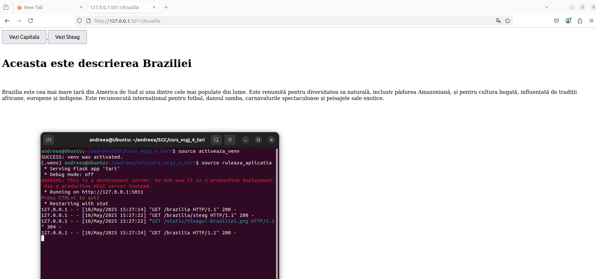
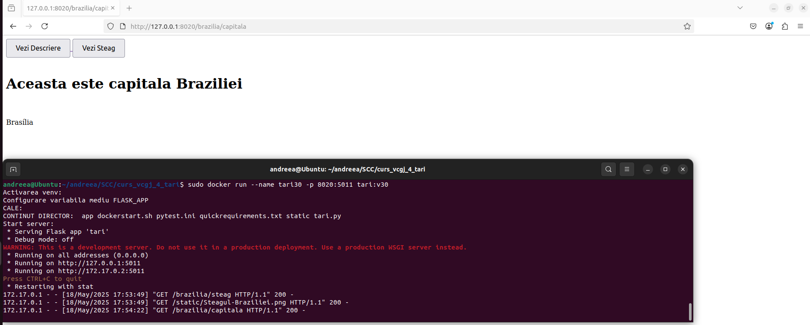
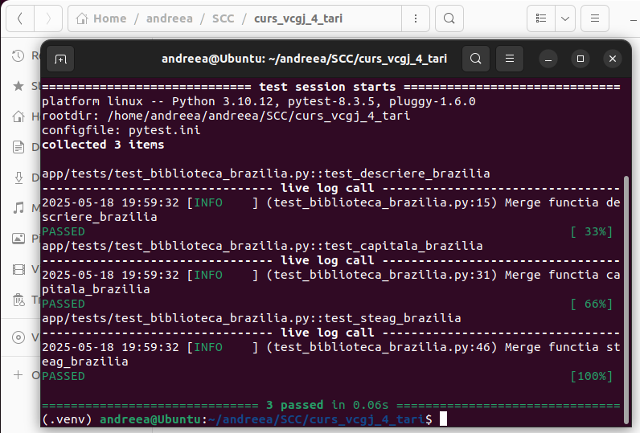
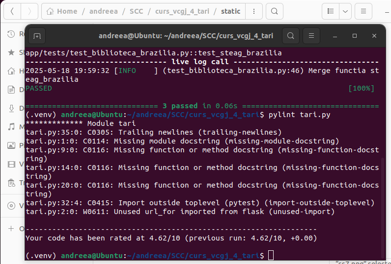
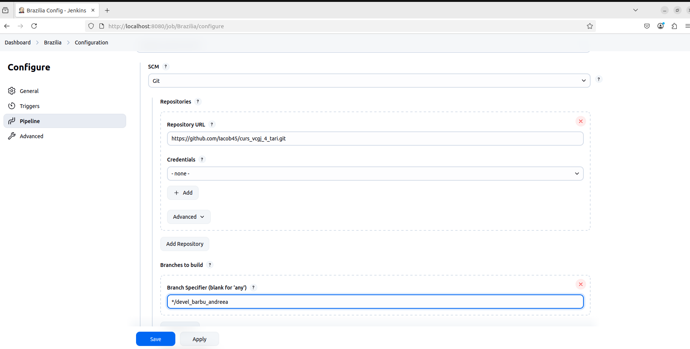
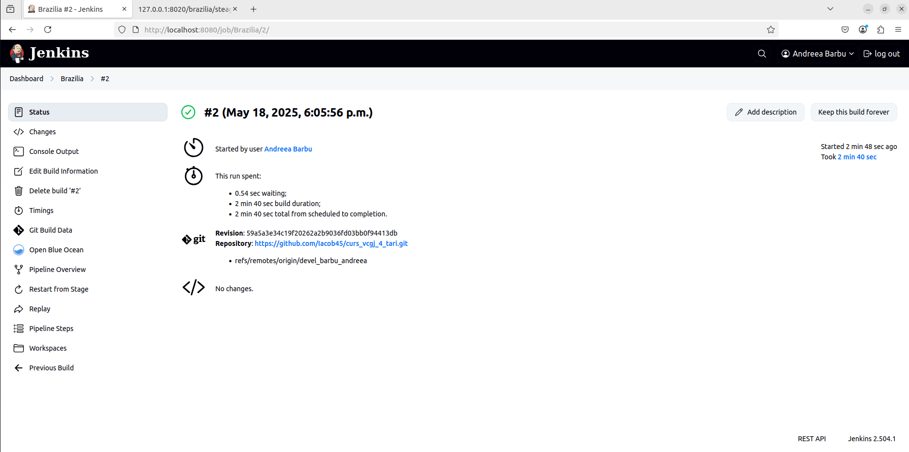
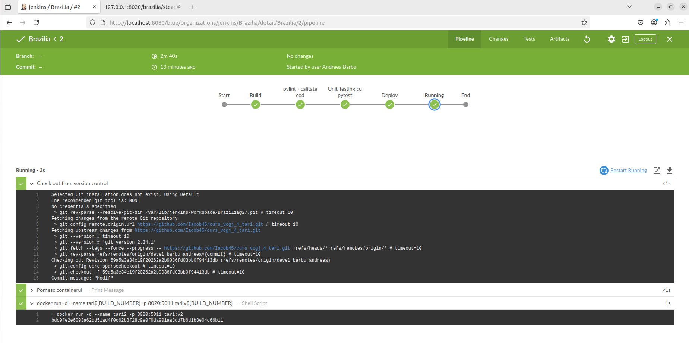
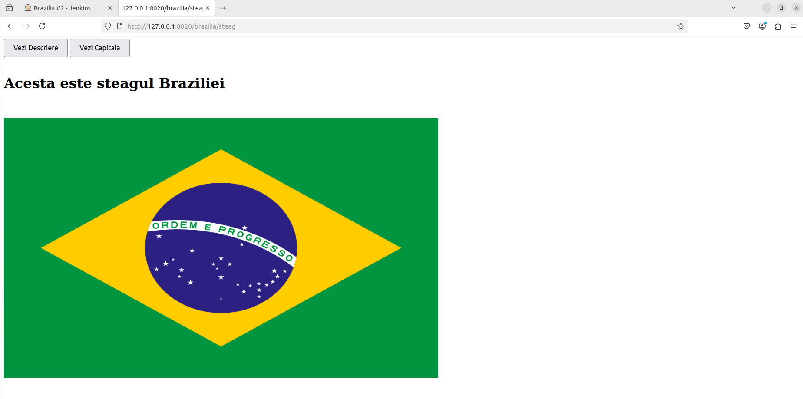

## BRAZILIA - BARBU ANDREEA-MARIA

# CUPRINS
- [Descrierea aplicației](#descrierea-aplicației)
- [Structura logică a aplicației](#structura-logică-a-aplicației)
- [Configurare](#configurare)
- [Pull request-urile utilizate în GitHub](#pull-request-urile-utilizate-în-github)
- [Rularea aplicației](#rularea-aplicației)
  - [În mediu local](#în-mediu-local)
  - [Cu Docker](#cu-docker)
- [Testarea aplicației](#testarea-aplicației)
  - [Cu Pytest](#cu-pytest)
  - [Cu Pylint](#cu-pylint)
  - [Cu Jenkins](#cu-jenkins)
  
# DESCRIEREA APLICAȚIEI

Aplicația este construită în **Python** folosind framework-ul **Flask** și oferă 
un API simplu prin care utilizatorii pot accesa informații esențiale despre Brazilia:

- *Descriere generală a țării* 
- *Numele capitalei* 
- *Informații despre steagul național*


# STRUCTURA LOGICĂ A APLICAȚIEI

Aplicația definește următoarele rute principale:

- `/brazilia` → descriere generală 
- `/brazilia/capitala` → numele capitalei 
- `/brazilia/steag` → detalii despre steag 

Logica asociată fiecărei rute este separată în fișierul: 
`biblioteca_brazilia.py`

Acesta conține funcțiile:

- `descriere_brazilia()`
- `capitala_brazilia()`
- `steag_brazilia()`

Aceste funcții sunt apelate din fișierul principal: `tari.py` 
Fișierul `tari.py` gestionează rutele și reprezintă punctul de pornire al aplicației Flask.

# CONFIGURARE

Se pregătește directorul de lucru(home/andreea/SCC/curs_vcgj_4_tari)si se va clona repository-ul:

```bash
git clone https://github.com/Iacob45/curs_vcgj_4_tari.git
```

Apoi se acceseaza branch-ul de dezvoltare

```bash
git checkout devel_barbu_andreea
```

Pentru a afisa starea curenta a repository-ului si pentru a modifica anumite fisiere se folosesc comenzile:

```bash
git add .
git commit -m "First commit"
git push
```
# PULL REQUEST-URILE UTILIZATE IN GITHUB

Ele permit colaboratorilor:
- `să revizuiască codul`
- `să sugereze îmbunătățiri`
- `să integreze doar codul testat și validat`

Exemple de Pull Request-uri:
 #26 - Devel barbu andreea 
Acest pull request a fost creat pentru a propune integrarea lucrării proprii realizate pe ramura devel_barbu_andreea
 #29 - Commit final 
În cadrul acestui pull request, a fost analizată versiunea finală propusă de un alt contributor. S-a verificat respectarea convențiilor de cod, funcționalitatea aplicației și existența testelor

# RULAREA APLICATIEI:

- `Intr-un mediu local`

Initial se activeaza mediul virtual .venv, iar dacă nu reușește, folosește o metodă alternativă pregătită pentru Jenkins. 
Ruleaza_aplicatia configurează variabila de mediu FLASK_APP și lansează aplicația Flask local, pe portul 5011. 
```bash
source activeaza_venv
source ruleaza_aplicatia
```



- `Cu Docker`
Comenzi utilizate:
```bash
sudo docker build -t tari:v30 .
sudo docker run --name tari -p 8020:5011 tari:v30
```
Comenzile creează o imagine Docker numită tari:v30 din fișierele locale și apoi pornesc un container numit tari care expune portul intern 5011 al aplicației pe portul local 8020, permițând accesul din afara containerului.



# Testarea aplicatiei:

## Cu Pytest

Testarea aplicației cu pytest permite verificarea automată a funcționalităților implementate, asigurând că răspunsurile oferite de rutele API sunt corecte și că aplicația funcționează conform așteptărilor, fără erori.
Comanda utilizata:
```bash
pytest
```



## Cu Pylint

Comanda pylint tari.py verifică stilul și corectitudinea codului sursă, oferind un raport detaliat cu probleme detectate și un scor de calitate, esențial pentru menținerea unui cod curat și ușor de întreținut.
Comanda utilizata:

```bash
pylint tari.py
```


## Cu Jenkins

Jenkins este utilizat pentru a automatiza procesul de testare, analiză și rulare a aplicației. Dupa pornirea jenkins (`sudo systemctl start jenkins`), acesta este configurat pentru a obține automat codul sursă dintr-un repository public de pe GitHub. Ca sistem de control al versiunii a fost selectat Git, iar în câmpul „Repository URL” a fost introdus linkul către proiectul:
https://github.com/Iacob45/curs_vcgj_4_tari.git.
Pentru autentificare nu au fost necesare credențiale, deoarece repository-ul este public. De asemenea, în secțiunea „Branches to build” a fost specificat branch-ul */devel_barbu_andreea, astfel încât Jenkins să urmărească și să ruleze pipeline-ul doar pentru această ramură de dezvoltare.

Jenkins afișează detalii despre durata totală a execuției, care în acest caz a fost de 2 minute și 40 de secunde, din care 54 de secunde au fost timp de așteptare, iar restul pentru execuția efectivă a pașilor de build. Se confirmă funcționarea completă a pipeline-ului, de la clonarea codului până la rularea finală.

In urmatoarea imagine se poate observa rularea pipeline-ului din Jenkins folosind interfața Blue Ocean, unde sunt vizualizate etapele executate automat pentru proiectul „Brazilia”. Fiecare etapă este reprezentată grafic, în ordine:
Start → pylint – calitate cod → Unit Testing cu pytest → Deploy → Running → End

Build-ul curent este în etapa Running, ceea ce indică faptul că aplicația a fost deja testată, verificată cu pylint, și containerizată cu Docker, iar acum rulează efectiv într-un container.

In final se observa functionarea corecta a aplicatiei:



