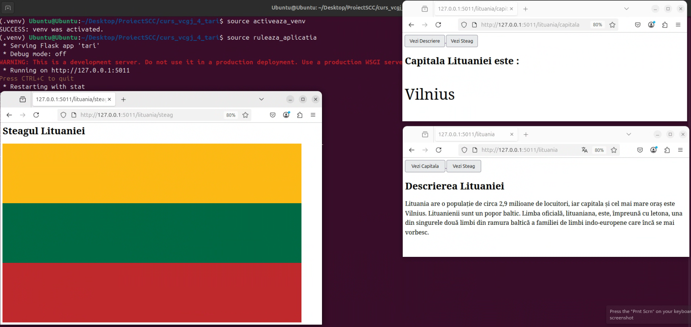

# Țară Implementată : Lituania
# Dezolvator Proiect : Calcan Cristian Nicolae
# Proiect DevOps, virtualizare, containerizare, github, jenkins. 

## Cuprins
- [Contribuții  la Implementare](#Contribuții-la-Implementare)
- [Tehnologii utilizate](#Tehnologii-utilizate)
- [Github](#github)
  - [Github Local Configurare + Pull Request](#Github-Local-Configurare-Pull-Request)
- [Rulare aplicatie Local](#Rulare-aplicatie-Local)
- [Rulare aplicatie Docker](#Rulare-aplicatie-Docker)
- [Testare cu pytest](#Testare-cu-pytest)
- [Testare cu pylint](#Testare-cu-pylint)
- [Testare cu Jenkins](#Testare-cu-Jenkins)

## Contribuții la Implementare

În cadrul cursului Servicii de cloud şi containerizare, se va realiza proiectul pentru tema “Ţări” prin implementarea unor tehnologii, precum: Flask, Docker, Jenkins şi GitHub.

Am integrat funcționalitatea corespunzătoare țării Lituania în aplicația web dezvoltată în cadrul proiectului de grup. Aplicația include trei endpoint-uri – “/lituania”, “/lituania/capitala” și “/lituania/steag” – fiecare afișând informații specifice. Proiectul este containerizat folosind Docker și include testare automată configurată prin Jenkins dar și scripturile specifice.

In proiect avem functiile specifice celor 3 endpointuri `descriere_lituania(),capitala_lituania,steag_lituania()` care sunt regasite in `app/lib/biblioteca_lituania.py`

Fișierul principal al aplicației, `tari.py`, definește trei rute, implementate folosind framework-ul Flask și accesibile prin metoda HTTP `GET` -> GET `/lituania,/lituania/capitala,/lituania/steag`

## Tehnologii utilizate

- Mașină virtuală Ubuntu – Mediu de dezvoltare și testare configurat pe o distribuție Linux (Ubuntu), utilizat pentru rularea aplicației și a serviciilor.

- Flask – Framework web scris în Python, utilizat pentru dezvoltarea aplicației și definirea endpoint-urilor.

- GitHub – Platformă pentru versionarea codului sursă și colaborarea în echipă.

- Docker – Utilizat pentru containerizarea aplicației, oferind un mediu de rulare izolat și ușor de reprodus.

- Jenkins – Instrument de integrare continuă, folosit pentru automatizarea procesului de testare și livrare a aplicației.

## Github

Pentru a stoca și pentru a eficienza modalitatea de migrare + lucrare în echipa am folosit Github,, pentru a respecta praticile de colaborare intre persoane și pentru a nu ne încurcă intre noi am folosit branch-uri (ramuri pentru fiecare persoană `main` și `devel`)

## Github Local Configurare + Pull Request
Proiectul a fost luat de pe Github cu ajutorul comenzii `git clone https://github.com/Iacob45/curs_vcgj_4_tari.git` în fișierul de pe Desktop pe mașină Virtuala.
Proiectul a fost implementat initial branch-ul personal `devel_calcan_cristian`.Au fost câteva probleme deoarece nu puteam să urc pe Github deoarece nu îmi găsea username-ul (am încercat cu config dar nu mers) și am rezolvat problema generând o cheie ssh (aceasta cheie a fost adăugată în contul de GitHub la setări ) prin următoarele comenzi fiecare rulată pe rând.

```
ssh-keygen -t ed25519 -C "cristi21cristi2124@gmail.com"
ls ~/.ssh
cat ~/.ssh/id_ed25519.pub
git remote set-url origin git@github.com:Iacob45/curs_vcgj_4_tari.git
git push --set-upstream origin devel_calcan_cristian
```

### Pull Requesturi

După ce am terminat tot proiectul care este adăugat în branch-ul local și cel de pe git numit  ``devel``  am realizat Pull Request din ``devel_calcan_cristian`` în ``main_calcan_cristian``
Putem să facem merge direct din git terminal cu ``git merge devel_calcan_cristian`` dar din cauza că avem restricție de aprobare trebuie făcut de pe ``https://github.com/Iacob45/curs_vcgj_4_tari/pull``, pentru realizarea acestuia unul din colegi trebuie să ne dea ``aproved`` la merge.
- PR Devel calcan cristian #16 
- PR Final Merge #15
- PR auto index delete #19


## Rulare aplicatie Local

Pentru a testa funcționalitatea implementată, aplicația poate fi rulată local într-un mediu virtual Python ``.venv``

### Configurare mediu de lucru 
  - Repository-ul a fost colonat de pe Github
     ``` git clone https://github.com/Iacob45/curs_vcgj_4_tari.git ```
    
  -  Mediul virtual Python a fost creat astfel folosind comenzile următoare `în terminal`:

```bash
source activeaza_venv
```
```bash
source activeaza_venv
```



## Rulare aplicatie Docker

- Pentru a rula aplicația pe Docker trebuie prima dată trebuie creată imaginea Docker.
- Prin fișierul DockerFile se configurează mediul pentru Flask, care instalează toate dependințe pentru a rula aplicația, utilizând scriptul dockerstart.sh
```bash
docker build -t tari:v01 .
```

- ####  Crearea si rularea containerului pe baza imaginii:

```bash
sudo docker run --name tari -p 8020:5011 tari:v01
```