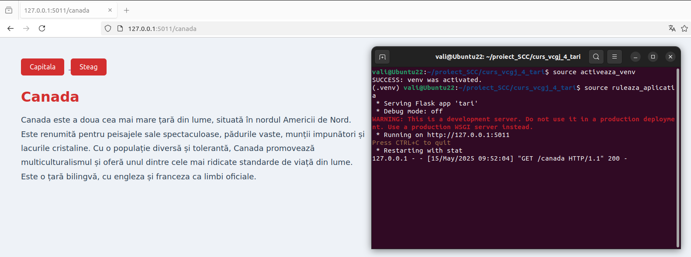

- **Dezvoltator**: Valentina Manta
- **Functie implementata**: Canada

## Functionalitate adaugata

Am implementat functionalitatea corespunzatoare tarii **Canada**:

## Funcționalitate implementată

Funcționalitatea dezvoltată în acest branch constă în adăugarea unui modul dedicat țării **Canada**, integrat în aplicația Flask existentă.

Au fost implementate trei rute HTTP (endpoint-uri API) care expun informații despre această țară prin metode specifice definite în fișierul `app/lib/biblioteca_tari.py`:

- `GET /canada` – punct de intrare general care oferă o descriere succintă a Canadei;
- `GET /canada/capitala` – returnează numele capitalei Canadei;
- `GET /canada/steag` – returnează drapelul Canadei.

Aceste rute sunt configurate în fișierul `tari.py`, care conține logica principală a aplicației Flask. Funcțiile asociate acestora sunt:
- `descriere_canada()`
- `capitala_canada()`
- `steag_canada()`

Modulul a fost integrat în aplicația existentă astfel încât să respecte arhitectura propusă și să poată fi extins ușor cu funcționalități suplimentare.

## Rulare locală a aplicației

Pentru a putea testa funcționalitatea adăugată, aplicația poate fi rulată local, într-un mediu virtual Python. Se recomandă utilizarea unui `venv` pentru a gestiona dependențele.

Mai jos sunt pașii necesari pentru rularea aplicației:

1. Se clonează repository-ul și se accesează branch-ul de dezvoltare corespunzător:

```bash
git clone https://github.com/Iacob45/curs_vcgj_4_tari.git
cd curs_vcgj_4_tari
git checkout devel_manta_valentina
```

2. Se activeaza venv si se ruleaza aplicatia, urmand a fi accesata in broswer la adresa 127.0.0.1:5011/canada

```bash
source activeaza_venv
source ruleaza_aplicatia
```


