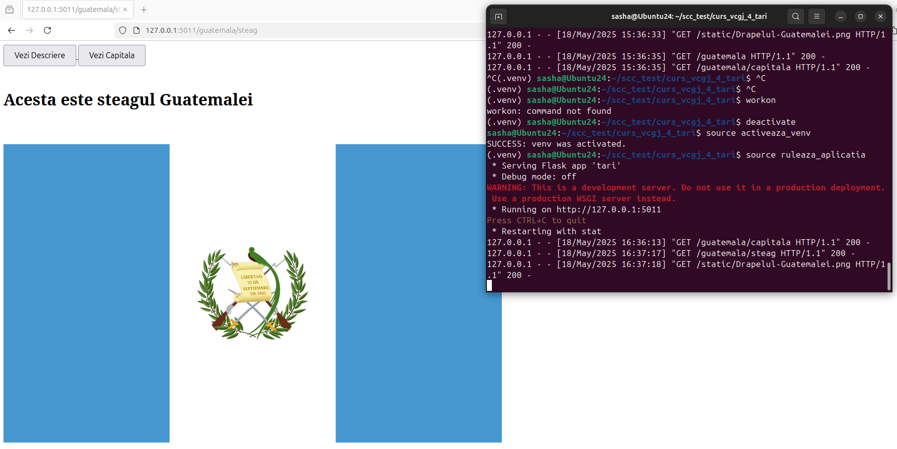
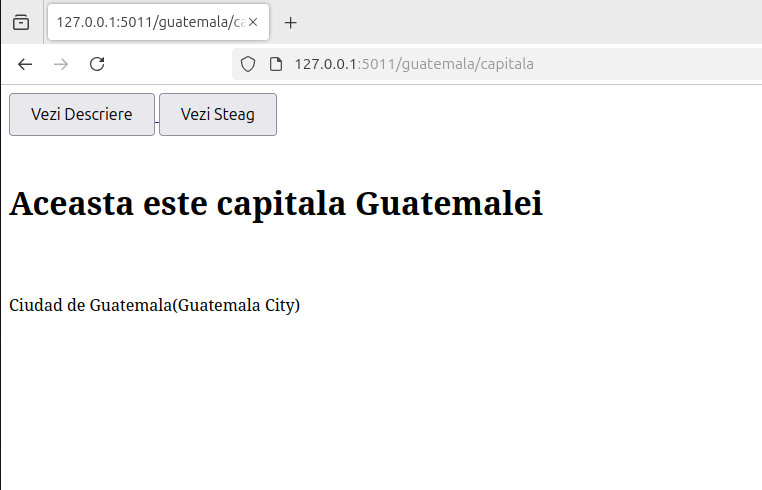
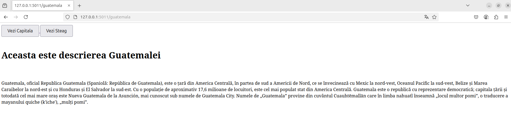
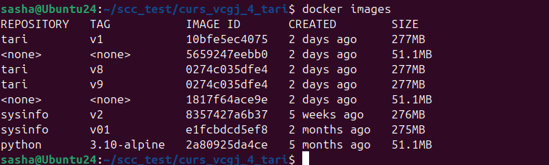
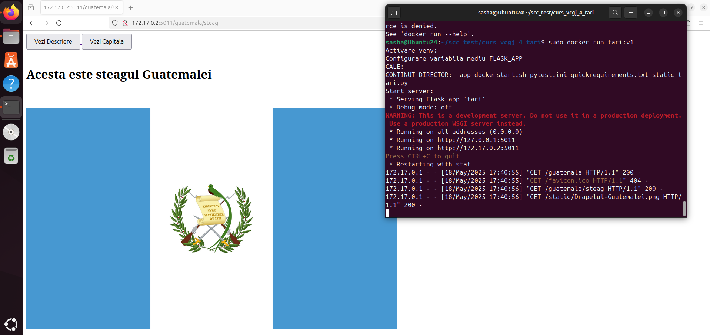
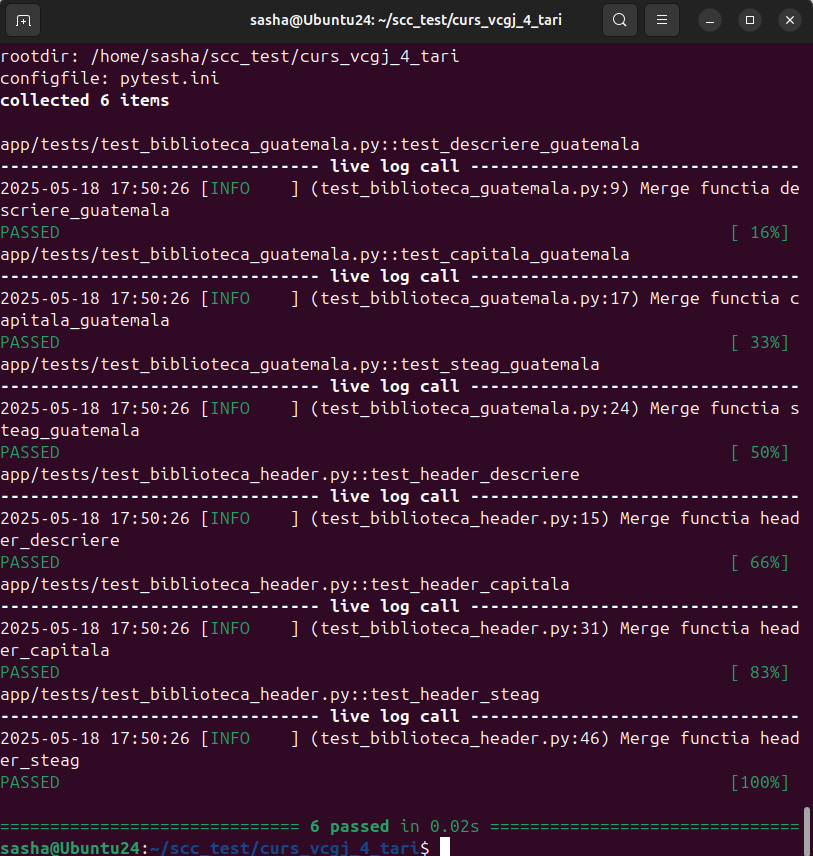
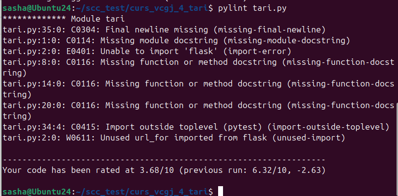

`Proiect SCC Tari:Guatemala - Guta Dan-Alexandru`
===================================

# Cuprins

1. [Descriere aplicatie](#descriere-aplicatie)
1. [Git & Pull-request](#git-pull-request)
1. [Rulare locala a aplicatiei](#rulare-locala)
1. [Rulare aplicatie Docker](#rulare-docker)
1. [Testare cu pytest](#test-pytest)
1. [Verificare statica cu pylint](#verificare-pylint)
1. [Testare cu Jenkins](#test-jenkins
1. [Bibliografie](#bibliografie)

# Descriere aplicatie

Aplicatia tari afiseaza date despre tara Guatemala si le afiseaza intr-o pagina web.
Poate fi executata doar pe Linux. A fost testata pe Ubuntu 24.04.02.
Componenta WEB a aplicatiei se bazeaza pe framework-ul `Flask`.
Acestea sunt preluate apoi in functii `view` si returnate clientului WEB care apeleaza serverul.

Pentru o navigare mai usoara in browser, pagina principala contine butoane catre celelalte pagini.

Aplicatia include suport pentru containerizare in fisierul `Dockerfile` din directorul principal al aplicatiei.

Din punct de vedere al testarii, este inculs unit testing cu pytest, pentru functiile din bibliotecile aplicatiei, aflate in directorul `app/lib`.

Pipeline-ul pentru Jenkins este definint in fisierul `Jenkinsfile`.

Cloneaza codul, creaza mediul de lucru virtual (venv-ul), il activeaza si ruleaza testele (unit test - cu pytest, verificari statice cu pylint).


# Git & Pull-request
[cuprins](#cuprins)

Pentru dezvoltarea aplicatiei am folosit sistemul de versionare `Git`, folosind site-ul `GitHub` cu cate o ramura pentru development si una de main.

Initial am dezvoltat aplicatia pe ramura `devel_guta_alexandru`, am realizat teste la cele 2 biblioteci `pylint` si `pytest`, iar dupa ce am ajuns la o versiune care functiona in `jenkins` si rula containerizat, am realizat un `pull-request` pentru a imbina cele doua ramuri.

Pull-request-urile realizate au fost supuse verificarii de catre cel putin unui coleg din grupa.

# Rulare locala a aplicatiei
[cuprins](#cuprins)

Aplicatia poate fi rulata local:

1. Clonarea de pe github a aplicatiei

```bash
git clone https://github.com/Iacob45/curs_vcgj_4_tari.git
cd curs_vcgj_4_tari
git checkout main_guta_alexandru
```
SAU pentru clonarea ramurei de dezvoltare
```bash
git checkout devel_guta_alexandru
```

2. Rularea aplicatiei local

```bash
source activeaza_venv
source ruleaza_aplicatia
```





# Rulare aplicatie Docker
[cuprins](#cuprins)

Ca aplicatia sa ruleze in container, trebuie creata imaginea docker

```bash
docker build -t tari:v1
```
 
 
 
Pentru a creea cointainerul pe baza imaginii trebuie folosita urmatoarea comanda:
 
```bash
docker run --name tari1 -p 8021:5011 tari:v1
```
 
Pentru a rula containere deja creeate se foloseste comanda
 
```bash
docker start tari1
```
 

 
# Testare cu pytest
[cuprins](#cuprins)

Pentru a testa functionalitatea folosim pytest, cu care vom folosii functiile `descriere_guatemala()`, `capitala_guatemala()` si `steag_guatemala()` din `biblioteca_guatemala.py`.

Pytest ne arata log-uri la functiile testate, daca nu au erori o sa apara `PASSED` in log.

Pentru a rula pytest am folosit comanda urmatoare:

```bash
PYTHONPATH=$(pwd) pytest
```


# Verificare statica cu pylint
[cuprins](#cuprins)

Biblioteca pylint poate fi folosita pentru evaluarea codului in python

Acesata evalueaza cat de bine este scris codul in python, scrie si problemele in timpul rularii.

Pentru a trece fisierul `tari.py` prin test cu pylint se va folosi comanda:

```bash
pylint tari.py
```



# Testare cu Jenkins
[cuprins](#cuprins)

Jenkins a fost folosit pentru automatizarea procesului de testare al aplicatei.

Pentru a verifica ca jenkins functioneaza am folosit comenzile

```bash
sudo systemctl start jenkins
sudo systemctl status jenkins
```

Pentru a accesa site-ul jenkins, se ruleaza aplicatia folosind comanda `jenkins` in terminal.

Site-ul ruleaza local in terminal la dresa `https://localhost:8080`.

In urma rularii putem folosi pluginul Jenkins numit `Blue Ocean` pentru o vizualizare mai buna a pasilor.

Avem 4 pasi: `Build`, `pylint-calitate cod`, `Unit Testing cu pytest`, `Deploy` si `Running`. 



# Bibliografie
[cuprins](#cuprins)

- [sysinfo](https://github.com/crchende/sysinfo/tree/main)
- [jenkinsdemo](https://github.com/crchende/jenkinsdemo?tab=readme-ov-file#instalare-jenkins)
