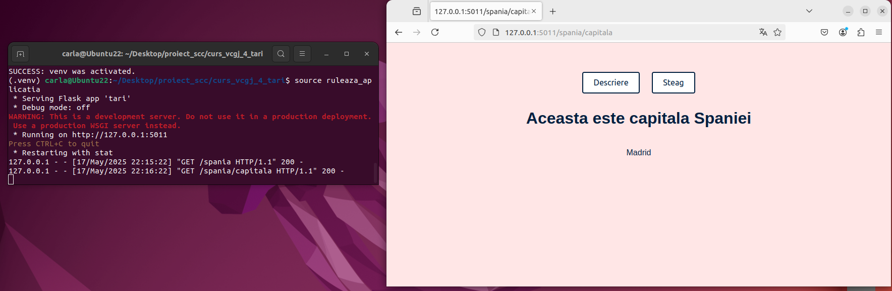
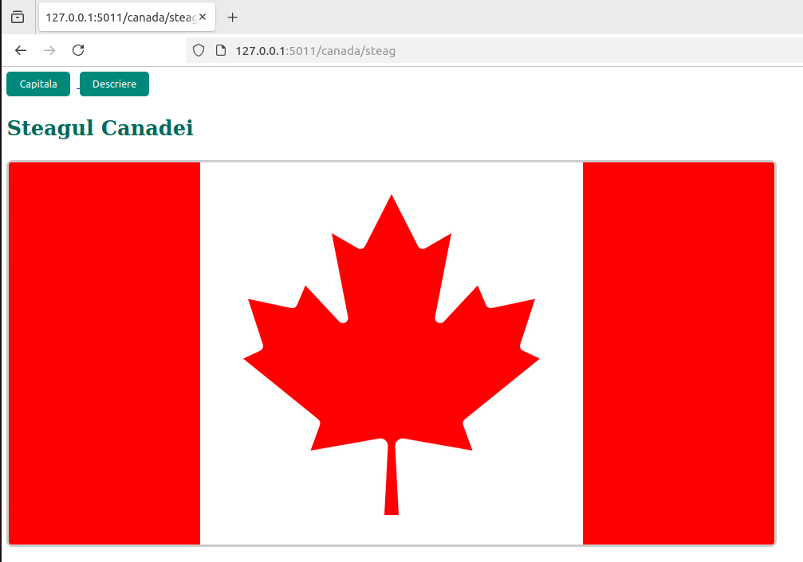
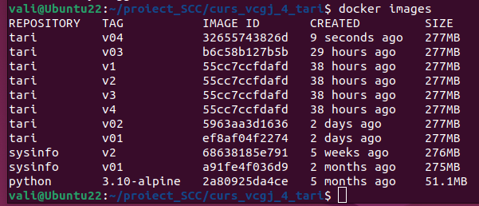
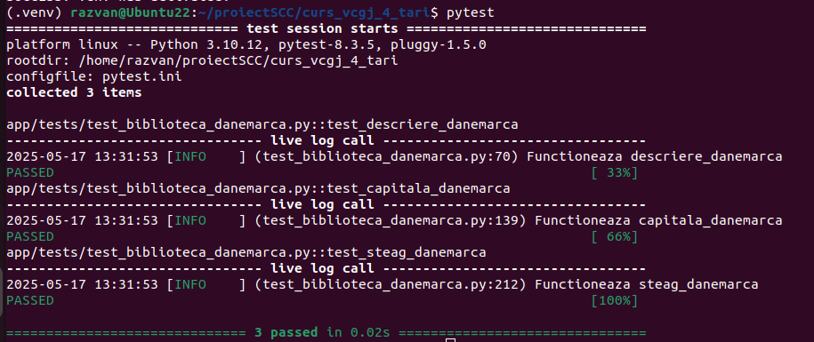
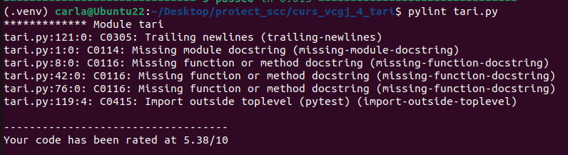
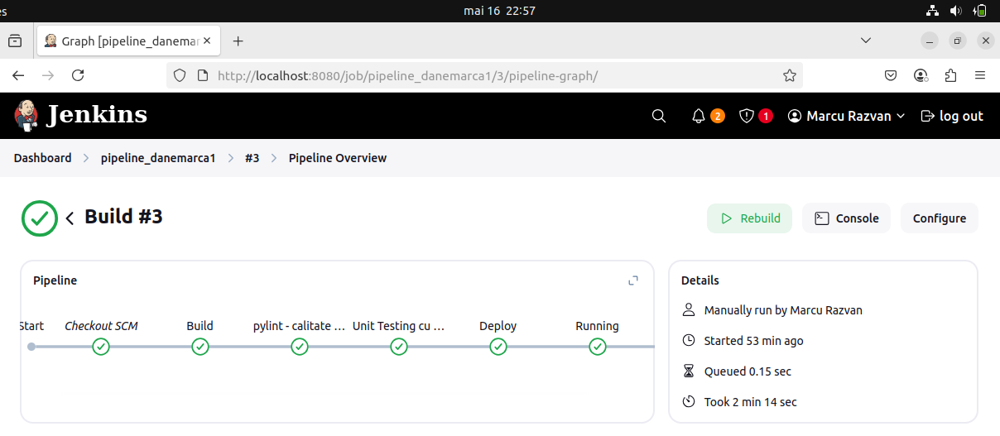
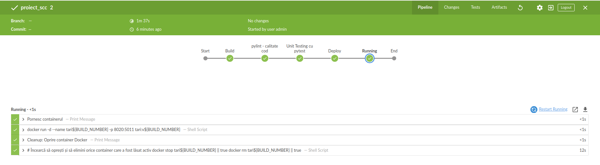

# Proiect curs_vcgj_4_tari
Proiect DevOps, virtualizare, containerizare, github, jenkins. 
Acest proiect contine o aplicatie Flask simpla, cu 3 endpoint-uri: "/" -> descrierea; "/capitala" -> capitala ; "/steag" -> steagul.
Se foloseste un fisier principal "tari.py" care contine cele 3 endpoint-uri, se folosesc biblioteci de functii care
intorc cod HTML in acele endpoint-uri, se folosesc biblioteci de functii de testare, se foloseste Docker pentru containerizare
si Jenkins pentru tot procesul de automatizare.

Tema proiect: Tari.

Teme luate: 
    Grecia: Roberta, 
    Spania: Carla,
    Canada: Vali,
    Kosovo: Alexandra,
    Franta: Stefi,
    Brazilia: Andreea,
    Lituania: Calcan,
    Egipt: Monica,
    Italia: Daria,
    Japonia: Ilie,
    Danemarca: Razvan,
    Malta: Ana,
    Germania: Gutescu,
    Olanda: Daniela,
    Romania: Iacob,
    Cristiana: Bulgaria,
    Sasha: Guatemala,
    Luxemburg: Buta,
    Vatican: Miron,
    Honduras: Furniga,
    Andorra: Maya,
    Monaco: Catalin,
    Norvegia: Dumitru
    
## Cuprins

- I. ROMANIA - Delcea Andrei-Iacob
- II. HONDURAS - Furniga Silviu Andrei
- III. CANADA - Manta Valentina

##I. ROMANIA - Delcea Andrei-Iacob
# „Info Romania” — Serviciu Web cu Flask 🇷🇴

Un serviciu web simplu, realizat în Python cu Flask, care afișează informații despre România: descriere generală, capitală și drapel.


## INDEX

* INTRODUCERE
* STRUCTURĂ
* PREGĂTIRE MEDIU
* RULARE LOCALĂ
* DOCKER
* RUTE DISPONIBILE
* TESTARE
* LINT ȘI CALITATE
* CI/CD (Jenkins)
* SCRIPTURI
* DEPENDINȚE
* LICENȚĂ & CONTRIBUȚII


## INTRODUCERE

Serviciul expune trei pagini HTML generate din funcții Python:

* **Descriere** – prezentare succintă a țării
* **Capitală** – afișează „București”
* **Tricolor** – afișează imaginea drapelului României


## STRUCTURĂ

```text
ProjectRoot/
│
├── tari.py                 # Flask app cu rutele HTTP
├── quickrequirements.txt   # Lista pachetelor Python
├── pytest.ini              # Configurații pytest
├── Jenkinsfile             # Pipeline: build, lint, test, deploy, run
├── Dockerfile              # Instrucțiuni Docker
├── dockerstart.sh          # Entrypoint pentru container
├── activeaza_venv          # Script venv local
├── activeaza_venv_jenkins  # Script venv Jenkins
├── ruleaza_aplicatia       # Script pornire server local
├── static/                 # Resurse statice
│   └── romania_flag.jpg    # Imagine drapel
└── app/                    # Codul organizațional
    ├── lib/                # Biblioteci interne
    │   ├── biblioteca_romania.py   # Generare text Romania
    │   └── biblioteca_header.py    # Generare header HTML
    └── tests/              # Teste unitare
        ├── test_biblioteca_romania.py
        └── test_biblioteca_header.py
```


## PREGĂTIRE MEDIU

1. Clonare repo:

```bash
git clone [https://github.com/Iacob45/curs\_vcgj\_4\_tari.git](https://github.com/Iacob45/curs_vcgj_4_tari.git)
cd curs\_vcgj\_4\_tari
```

2. Creare & activare virtualenv:
   ```bash
python3 -m venv .venv
source .venv/bin/activate   # Windows: .venv\Scripts\activate
```

3. Instalare dependențe:

```bash
pip install -r quickrequirements.txt
```


## RULARE LOCALĂ
Pornire server Flask pe portul **5011**:
```bash
bash ruleaza_aplicatia
````

Acces: `http://localhost:5011/romania`


## DOCKER

* Construire imagine:
```bash
docker build -t info-romania .
```

* Rulare container:
```bash
docker run -d -p 5011:5011 info-romania
```


## RUTE DISPONIBILE

* **GET** `/romania`        → descriere generală
* **GET** `/romania/capitala` → capitala (București)
* **GET** `/romania/steag`     → afișare drapel

Fiecare pagină include butoane de navigare create de `biblioteca_header`.


## TESTARE

* Testează biblioteca principală:

```bash
export PYTHONPATH=.
pytest app/tests/test\_biblioteca\_romania.py
```

* Testează header:
```bash
export PYTHONPATH=.
pytest app/tests/test_biblioteca_header.py
```

* Pentru ambele simultan:

```bash
pytest
```


## LINT ȘI CALITATE
Verifică stilul codului cu pylint:
```bash
pylint --exit-zero $(find app/lib -name '*.py')
pylint --exit-zero $(find app/tests -name '*.py')
pylint --exit-zero tari.py
````


## CI/CD (Jenkins)

**Jenkinsfile** realizează:

* *BUILD* – setare venv
* *LINT* – pylint pe librării și teste
* *TEST* – `flask --app tari test`
* *DEPLOY* – build Docker image
* *RUN* – rulează containerul


## SCRIPTURI

* **activeaza\_venv**, **activeaza\_venv\_jenkins** – creare + activare venv
* **ruleaza\_aplicatia** – pornire Flask local
* **dockerstart.sh** – activare venv + pornire Flask în Docker


## DEPENDINȚE

* Flask
* pytest
* pylint
* matplotlib
* gunicorn


## LICENȚĂ & CONTRIBUȚII

Licența este definită în fișierul `LICENSE`. Contribuțiile sunt binevenite prin pull request-uri care trec testele și lint-ul.


##II. HONDURAS - Furniga Silviu Andrei
**Aplicație Flask: Informații despre Honduras**

Această aplicație oferă informații despre Honduras printr-o interfață web simplă bazată pe Flask. Include trei endpoint‑uri care returnează conținut HTML: descriere generală a țării, capitala și imaginea steagului.

---

## Cuprins

- I. Structura proiectului
- II. Instalare și configurare
- III. Rulare aplicație
- IV. Endpoint-uri disponibile
- V. Testare
- VI. Controlul calității codului
- VII. CI/CD (Jenkins)
- VIII. Docker
- IX. Scripturi utile
- X. Dependințe externe
- XI. Licență

---

#I. Structura proiectului

```
├── tari.py                      # Fișierul principal al aplicației Flask
├── ruleaza_aplicatia            # Script Bash pentru rularea aplicației
├── quickrequirements.txt        # Lista modulelor externe necesare
├── pytest.ini                   # Configurația pytest
├── Jenkinsfile                  # Pipeline CI/CD (Build, Quality, Test, Deploy, Run)
├── Dockerfile                   # Definiție imagine Docker
├── dockerstart.sh               # Entrypoint pentru container Docker
├── activeaza_venv               # Script de activare venv local
├── activeaza_venv_jenkins       # Script de creare și activare venv în Jenkins
├── LICENSE                      # Licența proiectului
├── README.md                    # Documentația proiectului
├── .gitignore                   # Fișier de excludere Git
├── static/                      # Fișiere statice (imagini, CSS, etc.)
│   └── honduras__42861.jpg      # Steagul Honduras
└── app/                         # Codul aplicației organizat în pachete
    ├── lib/                     # Funcții de generare a conținutului HTML
    │   └── biblioteca_honduras.py
    └── tests/                   # Teste unitare pentru bibliotecă
        └── test_biblioteca_honduras.py
```

---

#II. Instalare și configurare

### 1. Clonare repository

```bash
git clone https://github.com/Iacob45/curs_vcgj_4_tari.git
cd curs_vcgj_4_tari
```

### 2. Configurare mediu Python

```bash
python3 -m venv .venv
source .venv/bin/activate     # Windows: .venv\Scripts\activate
pip install --upgrade pip
pip install -r quickrequirements.txt
```

### 3. Fișier de configurare pentru testing

* `pytest.ini` definește directorul rădăcină și markerii folosiți.

---

#III. Rulare aplicație

### Local

```bash
bash ruleaza_aplicatia
```

### Docker

```bash
docker build -t aplicatie-honduras .
docker run --rm -p 5011:5011 aplicatie-honduras
```

Aplicația va fi disponibilă pe `http://localhost:5011/honduras`

---

#IV. Endpoint-uri disponibile

| Ruta                 | Descriere                                 | Metodă |
| -------------------- | ----------------------------------------- | ------ |
| `/honduras`          | Descriere generală a Honduras             | GET    |
| `/honduras/capitala` | Informații despre capitala Honduras       | GET    |
| `/honduras/steag`    | Afișează steagul Honduras ca imagine HTML | GET    |

Fiecare pagină include linkuri de navigare între endpoint-uri și conținut HTML generat din `app/lib/biblioteca_honduras.py`.

---

#V. Testare

Testele sunt în `app/tests/test_biblioteca_honduras.py` și verifică funcțiile:

- descriere_honduras()
- capitala_honduras()
- steag_honduras()

Rulare teste:

```bash
# PYTHONPATH=. este setat pentru ca toate directoarele si fiserele
# din proiect sa fie vizibile
export PYTHONPATH=.
pytest -v
```

---

#VI. Controlul calității codului

Se folosește `pylint` pentru analiza statică a codului. Pentru a rula:

```bash
pylint app/lib/biblioteca_honduras.py app/tests/test_biblioteca_honduras.py tari.py
```

---

#VII. CI/CD (Jenkins)

Pipeline-ul definit în `Jenkinsfile` conține următoarele etape:

1. **Build** – verifică structura directorului, pornește mediul virtual
2. **Controlul calității** – rulează `pylint` pe toate fișierele relevante
3. **Unit Testing** – rulează `pytest`
4. **Deploy** – creează o imagine Docker marcată cu `BUILD_NUMBER`
5. **Run** – pornește containerul cu portul 8020 mapat la 5011

---

#VIII. Docker

- **Dockerfile**: imagine bazată pe Python 3.10 Alpine, creează utilizator non-root, copiază codul și scripturile, setează permisiuni și rulează aplicația cu entrypointul `dockerstart.sh`.
- **dockerstart.sh**: activează mediul virtual și pornește aplicația cu `flask run` pe `0.0.0.0:5011`

---

#IX. Scripturi utile

dockerstart.sh – entrypoint pentru aplicație în Docker
ruleaza_aplicatia – pornește serverul Flask local
activeaza_venv / activeaza_venv_jenkins – creează și activează mediu virtual pentru local și Jenkins

---

#X. Dependințe externe

- Flask
- pytest
- pylint
- matplotlib
- gunicorn

---

#XI. Licență

Acest proiect este licențiat sub licența MIT definită în fișierul `LICENSE`.


##III. CANADA - Manta Valentina-Elena

Stadiul implementării: funcționalitate completă, testare finalizată, integrare realizată în branch-ul principal `main_manta_valentina`.

## Cuprins

- [Element adăugat](#element-adăugat)
- [Flux de lucru Git și Pull Request-uri](#Flux-de-lucru-Git-și-Pull-Request-uri)
- [Integrare și colaborare GitHub](#Integrare-și-colaborare-GitHub)
  - [Pull Request-uri proprii](#Pull-Request-uri-proprii)
  - [Review-uri efectuate](#Review-uri-efectuate)
- [Implementare funcționalitate](#implementare-funcționalitate)
- [Rulare locală a aplicației](#rulare-locală-a-aplicației)
- [Rulare aplicație cu Docker](#rulare-aplicație-cu-docker)
- [Testare cu pytest](#testare-cu-pytest)
- [Testare calitate cod cu pylint](#testare-calitate-cod-cu-pylint)
- [Testare automată cu Jenkins](#testare-automată-cu-jenkins)
  - [Etapele testării](#etapele-testării)

## Element adăugat

Am integrat funcționalitatea corespunzătoare țării **Canada** în aplicația software dezvoltată la nivelul grupei.

## Implementare funcționalitate

Am implementat funcțiile specifice elementului adăugat în `app/lib/biblioteca_canada.py` care vor afișa informațiile necesare descrierii generale a țării:

- `descriere_canada()`
- `capitala_canada()`
- `steag_canada()`

Aplicația principală, `tari.py`, definește 3 rute implementate cu ajutorul framework-ului Flask, accesibile prin metoda HTTP `GET`, fiecare returnând conținut HTML generat de funcțiile de mai sus. Fiecare rută corespunde unei componente informaționale distincte.

- `GET /canada` – punct de intrare general care oferă o descriere pe scurt a Canadei;
- `GET /canada/capitala` – returnează numele capitalei Canadei;
- `GET /canada/steag` – returnează drapelul Canadei.

Modulul a fost integrat în aplicația existentă astfel încât să respecte arhitectura propusă și să poată fi extins ușor cu funcționalități suplimentare.

## Flux de lucru Git și Pull Request-uri

Pentru dezvoltarea funcționalității, am utilizat un flux de lucru organizat pe ramuri (branch-uri), care respectă bunele practici de colaborare GitHub.

Inițial, am implementat codul în branch-ul personal de dezvoltare: `devel_manta_valentina`. După ce funcționalitatea a fost testată local, analizată cu `pylint` și validată prin teste cu `pytest` și Jenkins, codul a fost integrat progresiv:

 **PR intern** – am realizat un *Pull Request* de la `devel_manta_valentina` către `main_manta_valentina` pentru a valida integritatea codului meu și a simula procesul de integrare.

Fiecare Pull Request a fost supus unui proces de revizuire (`code review`) din partea colegilor de grupă. Acest flux a asigurat o integrare controlată și o dezvoltare colaborativă coerentă.

## Integrare și colaborare GitHub

În cadrul procesului de colaborare și validare a codului, am respectat cerințele impuse pentru integrarea prin Pull Request-uri (PR):

- La deschiderea Pull Request-ului către `main_manta_valentina`, am inclus rezultatele rulării testelor automate în Jenkins (capturi + status PASS).
- După validarea codului, PR-ul a fost aprobat și integrat.

### Pull Request-uri proprii

- PR #9 - Devel manta valentina
- PR #22 - Actualizare aplicatie 2

### Review-uri efectuate

- PR #23 - Test PR 1
- PR #26 - Devel barbu andreea

## Rulare locală a aplicației

Pentru a putea testa funcționalitatea adăugată, aplicația poate fi rulată local, într-un mediu virtual Python `(.venv)`.

1. Se clonează repository-ul și se accesează branch-ul de dezvoltare corespunzător:

```bash
mkdir proiect_SCC
cd proiect_SCC
git clone https://github.com/Iacob45/curs_vcgj_4_tari.git
cd curs_vcgj_4_tari
git checkout devel_manta_valentina
```

2. Se activează venv în directorul curent și se rulează aplicația, urmând a fi accesată în browser la adresa 127.0.0.1:5011/canada:

```bash
source activeaza_venv
source ruleaza_aplicatia
```





## Rulare aplicație cu Docker

Pentru a asigura portabilitatea și rularea aplicației într-un mediu izolat, proiectul a fost containerizat folosind Docker. Prin fișierul `Dockerfile` se configurează Flask, se creează mediul de rulare al aplicației și dependințele acesteia. Pornirea aplicației este asigurată de scriptul `dockerstart.sh`.

1. Acest proces presupune crearea unei imagini Docker care include codul aplicației, dependențele Python și configurațiile necesare pentru execuție.

```bash
sudo docker build -t tari:v04 .
```

2. După construirea imaginii, aplicația poate fi rulată într-un container, accesibil local prin browser (portul 5011 este mapat pe 8020). Astfel, indiferent de sistemul de operare sau de configurația locală, funcționalitatea poate fi testată și demonstrată uniform.

```bash
sudo docker run --name tari -p 8020:5011 tari:v04
```




## Testare cu pytest

Folosind framework-ul Python **pytest** am dezvoltat teste unitare, construite pentru a verifica dacă funcțiile `descriere_canada()`, `capitala_canada()` și `steag_canada()` returnează conținutul HTML corespunzător, conform specificațiilor. În cazul trecerii unui test, valoarea returnată va fi PASS, iar în caz contrar FAIL. Fișierul `pytest.ini` controlează testele, direcționând în principal către locația fișierului ce conține testele efective, `app/tests/test_biblioteca_canada.py`.

1. Inițial, se pornește testarea aplicației prin comanda: `pytest`.

2. După efectuarea tuturor testelor create, în consolă se pot observa rezultatele fiecărui test și eventualele comentarii.



## Testare calitate cod cu pylint

Instrumentul de analiză statică a codului Python, pylint, a fost utilizat pentu a evalua calitatea codului aplicației principale (complexitate, repetiții), stilul codului, variabile, funcții neutilizate.

1. Pornirea testării se face prin comanda `pylint tari.py`.

2. Rezultatele sunt observate în consolă la final și sunt returnate note, scoruri, recomandări și coduri ale eventualelor erori.



## Testare automată cu Jenkins

Jenkins este un utilitar open-source de integrare continuă (CI) pe care l-am folosit cu scopul automatizării testării aplicației. Acest lucru este important, deoarece permite integrarea pe branch-urile principale doar a aplicaților funcționale.

1. Pentru început, se verifică starea serviciului Jenkins și se pornește. Platforma web a utilitarului se accesează local, https://localhost:8080.

```bash
systemctl status jenkins
jenkins
```

2. În aplicația web, se creează pipeline-ul, cu setările aferente preluării datelor din repository-ul proiectului.



3. Pentru a începe testarea se apasă **Build**, iar rezultatele se pot observa cu ajutorul plug in-ului **Blue Ocean**, foarte detaliat pe fiecare etapă în parte.



### Etapele testării

Fișierul `Jenkinsfile` conține cele 5 etape de testare automată prin care va trece programul pentru a analiza complet aplicația.

1. **Build** ~
Are rolul de a crea mediul de lucru necesar aplicației, prin activarea mediului virtualizat (.venv).

2. **pylint-calitate cod** ~
Testează calitatea codului prin rularea pylint pe fișierele din `app/lib/`, `app/tests/`, `tari.py`. Flow-ul de testare nu va fi oprit în cazul erorilor.

3. **Unit Testing cu pytest** ~
Rulează aplicația prin comanda `flask --app tari test`, care declanșează pytest. Astfel, se verifică dacă HTML-ul returnat este corect.

4. **Deploy** ~
Creează o imagine Docker cu etichetă tari:v<ID> și build ID-ul este unic la fiecare rulare (variabila ${BUILD_NUMBER}).

5. **Running** ~
Pornește container-ul în fundal, rulează aplicația în container Docker și asociază portul 8020 de pe host cu portul 5011 de pe container.

