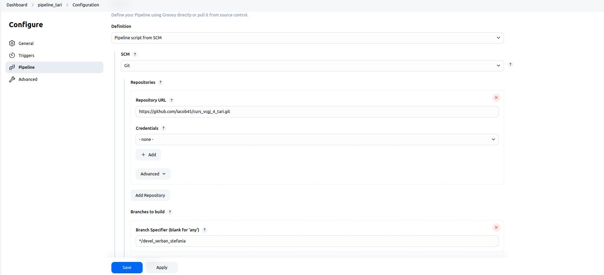

## GERMANIA - Gutescu Andrei-Dan

---

## Cuprins

- [Descriere aplicație](#descriere-aplicație)
- [Tehnologii utilizate și mediu de dezvoltare](#tehnologii-utilizate-și-mediu-de-dezvoltare)
- [Rularea aplicației local și procesul de dezvoltare](#rularea-aplicației-local-și-procesul-de-dezvoltare)

---

## Descriere aplicație

Proiectul a fost realizat folosind framework-ul Flask și are ca scop afișarea unor informații relevante despre Germania. Aplicația oferă trei rute (endpoint-uri) accesibile prin metoda HTTP `GET`: `/germania`, `/germania/capitala` și `/germania/steag`. Aplicația principală `tari.py` definește cele 3 rute și utilizează funcții implementate în modulele `biblioteca_germania.py` și `biblioteca_header.py`, care vor afișa informațiile necesare descrierii generale a țării.

---

## Tehnologii utilizate și mediu de dezvoltare

- **Flask** – Framework web în Python, folosit pentru dezvoltarea aplicației și definirea rutelor care oferă informații despre Germania.
- **Git/GitHub** – Git a fost folosit pentru versionarea locală a codului, iar GitHub pentru colaborarea în echipă, gestionarea branch-urilor, Pull Request-urilor și code review.
- **Docker** – Tehnologie de containerizare care permite rularea aplicației într-un mediu izolat și portabil.
- **Jenkins** – Sistem de integrare continuă utilizat pentru rularea automată a testelor, analizarea codului și livrarea aplicației.
- **Mașină virtuală Ubuntu** – Mediu de dezvoltare și testare, configurat pe o distribuție Linux (Ubuntu 22.04), în care s-au instalat și rulat toate componentele proiectului.

---

## Rularea aplicației local și procesul de dezvoltare

Pentru rularea aplicației la nivel local, s-au urmat pașii de mai jos:

###  Configurare mediu de lucru

- A fost creat și activat un mediu virtual Python folosind comenzile:

```bash
python3 -m venv .venv
source .venv/bin/activate
```

- Repository-ul a fost clonat local de pe GitHub:

```bash
git clone https://github.com/<user>/curs_vcgj_4_tari.git
```

###  Adăugarea și urcarea modificărilor pe GitHub

```bash
git add .
git commit -m "Mesaj commit"
git push origin devel_gutescu_andrei
```

Integrarea în ramura principală `main_gutescu_andrei` s-a realizat prin crearea unui Pull Request.

###  Structura proiectului

Au fost create toate fișierele și directoarele necesare pentru rularea și testarea aplicației:

- Dockerfile, Jenkinsfile, tari.py, quickrequirements.txt  
- Scripturi de rulare: activeaza_venv, ruleaza_aplicatia, dockerstart.sh  
- Fișiere pentru testare: pytest.ini 
- Folderul app/ conține subfolderele lib/ și tests/, împreună cu fișierele Python corespunzătoare

  ###  Containerizarea aplicației cu Docker

Crearea imaginii Docker: 

```bash
docker build -t tari:v01 .
```


Crearea si rularea containerului pe baza imaginii: 

```bash
sudo docker run --name scriitori -p 8020:5011 tari:v01
```


Aplicația a fost accesată la:
```
http://127.0.0.1:8020/germania
```


Containerul care ruleaza:


###  Testarea aplicației

Testarea automată a fost realizată cu `pytest`, în directorul `app/tests/`, utilizând configurația din `pytest.ini`.

###  Integrare continuă cu Jenkins

Jenkins a fost utilizat pentru automatizarea procesului de testare și livrare a aplicației. Pipeline-ul a inclus următoarele etape:

- **Build** – construiește imaginea Docker folosind Dockerfile-ul și etichetează imaginea
- **pylint – calitate cod** – verifică stilul și erorile de cod
- **Unit Testing cu pytest** – rulează testele definite în proiect
- **Deploy** – creează imaginea finală Docker
- **Running** – rulează containerul și face aplicația disponibilă pe portul 8020


