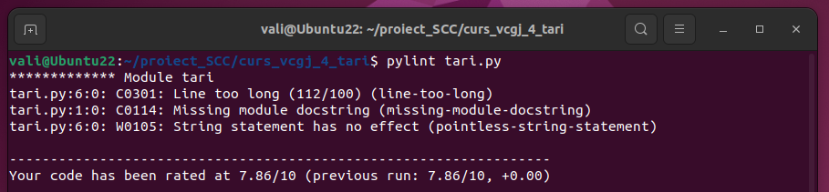

- **Dezvoltator**: Valentina Manta
- **Funcție implementată**: Canada

## Cuprins

- [Element adăugat](#element-adăugat)
- [Flux de lucru Git și Pull Request-uri](#Flux-de-lucru-Git-și-Pull-Request-uri)
- [Integrare și colaborare GitHub](#Integrare-și-colaborare-GitHub)
  - [Pull Request-uri proprii](#Pull-Request-uri-proprii)
  - [Review-uri efectuate](#Review-uri-efectuate)
- [Implementare funcționalitate](#implementare-funcționalitate)
- [Rulare locală a aplicației](#rulare-locală-a-aplicației)
- [Rulare aplicație cu Docker](#rulare-aplicație-cu-docker)
- [Testare cu pytest](#testare-cu-pytest)
- [Testare calitate cod cu pylint](#testare-calitate-cod-cu-pylint)
- [Testare automată cu Jenkins](#testare-automată-cu-jenkins)
  - [Etapele testării](#etapele-testării)

## Element adăugat

Am integrat funcționalitatea corespunzătoare țării **Canada** în aplicația software dezvoltată la nivelul grupei.

## Implementare funcționalitate

Am implementat funcțiile specifice elementului adăugat în `app/lib/biblioteca_canada.py` care vor afișa informațiile necesare descrierii generale a țării:

- `descriere_canada()`
- `capitala_canada()`
- `steag_canada()`

Aplicația principală, `tari.py`, definește 3 rute implementate cu ajutorul framework-ului Flask, accesibile prin metoda HTTP `GET`, fiecare returnând conținut HTML generat de funcțiile de mai sus. Fiecare rută corespunde unei componente informaționale distincte.

- `GET /canada` – punct de intrare general care oferă o descriere pe scurt a Canadei;
- `GET /canada/capitala` – returnează numele capitalei Canadei;
- `GET /canada/steag` – returnează drapelul Canadei.

Modulul a fost integrat în aplicația existentă astfel încât să respecte arhitectura propusă și să poată fi extins ușor cu funcționalități suplimentare.

## Flux de lucru Git și Pull Request-uri

Pentru dezvoltarea funcționalității, am utilizat un flux de lucru organizat pe ramuri (branch-uri), care respectă bunele practici de colaborare GitHub.

Inițial, am implementat codul în branch-ul personal de dezvoltare: `devel_manta_valentina`. După ce funcționalitatea a fost testată local, analizată cu `pylint` și validată prin teste automate cu `pytest` și Jenkins, codul a fost integrat progresiv:

 **PR intern** – am realizat un *Pull Request* de la `devel_manta_valentina` către `main_manta_valentina` pentru a valida integritatea codului meu și a simula procesul de integrare.

Fiecare Pull Request a fost supus unui proces de revizuire (`code review`) din partea colegilor de grupă. Acest flux a asigurat o integrare controlată și o dezvoltare colaborativă coerentă.

## Integrare și colaborare GitHub

În cadrul procesului de colaborare și validare a codului, am respectat cerințele impuse pentru integrarea prin Pull Request-uri (PR):

- La deschiderea Pull Request-ului către `main`, am inclus rezultatele rulării testelor automate în Jenkins (capturi + status PASS).
- După validarea codului, PR-ul a fost aprobat și integrat.

### Pull Request-uri proprii

- ✅ PR #9 - Devel manta valentina
- ✅ PR #22 - Actualizare aplicatie 2

### Review-uri efectuate

- 🔍 PR #23 - Test PR 1

## Rulare locală a aplicației

Pentru a putea testa funcționalitatea adăugată, aplicația poate fi rulată local, într-un mediu virtual Python `(.venv)`.

1. Se clonează repository-ul și se accesează branch-ul de dezvoltare corespunzător:

```bash
mkdir proiect_SCC
cd proiect_SCC
git clone https://github.com/Iacob45/curs_vcgj_4_tari.git
cd curs_vcgj_4_tari
git checkout devel_manta_valentina
```

2. Se activează venv în directorul curent și se rulează aplicația, urmând a fi accesată în browser la adresa 127.0.0.1:5011/canada:

```bash
source activeaza_venv
source ruleaza_aplicatia
```


## Rulare aplicație cu Docker

Pentru a asigura portabilitatea și rularea aplicației într-un mediu izolat, proiectul a fost containerizat folosind Docker. Prin fișierul `Dockerfile` se configurează Flask, se creează mediul de rulare al aplicației și dependințele acesteia. Pornirea aplicației este asigurată de scriptul `dockerstart.sh`.

1. Acest proces presupune crearea unei imagini Docker care include codul aplicației, dependențele Python și configurațiile necesare pentru execuție.

```bash
sudo docker build -t tari:v04 .
```

2. După construirea imaginii, aplicația poate fi rulată într-un container, accesibil local prin browser (portul 5011 este mapat pe 8020). Astfel, indiferent de sistemul de operare sau de configurația locală, funcționalitatea poate fi testată și demonstrată uniform.

```bash
sudo docker run --name tari -p 8020:5011 tari:v04
```


## Testare cu pytest

Folosind framework-ul Python **pytest** am dezvoltat teste unitare, construite pentru a verifica dacă funcțiile `descriere_canada()`, `capitala_canada()` și `steag_canada()` returnează conținutul HTML corespunzător, conform specificațiilor. În cazul trecerii unui test, valoarea returnată va fi PASS, iar în caz contrar FAIL. Fișierul `pytest.ini` controlează testele, direcționând în principal către locația fișierului ce conține testele efective, `app/tests/test_biblioteca_canada.py`.

1. Inițial, se pornește testarea aplicației prin comanda: `pytest`.

2. După efectuarea tuturor testelor create, în consolă se pot observa rezultatele fiecărui test și eventualele comentarii.


## Testare calitate cod cu pylint

Instrumentul de analiză statică a codului Python, pylint, a fost utilizat pentu a evalua calitatea codului aplicației principale (complexitate, repetiții), stilul codului, variabile, funcții neutilizate.

1. Pornirea testării se face prin comanda `pylint tari.py`.

2. Rezultatele sunt observate în consolă la final și sunt returnate note, scoruri, recomandări și coduri ale eventualelor erori.



## Testare automată cu Jenkins

Jenkins este un utilitar open-source de integrare continuă (CI) pe care l-am folosit cu scopul automatizării testării aplicației. Acest lucru este important, deoarece permite integrarea pe branch-urile principale doar a aplicaților funcționale.

1. Pentru început, se verifică starea serviciului Jenkins și se pornește. Platforma web a utilitarului se accesează local, https://localhost:8080.

```bash
systemctl status jenkins
jenkins
```

2. În aplicația web, se creează pipeline-ul, cu setările aferente preluării datelor din repository-ul proiectului.


3. Pentru a începe testarea se apasă **Build**, iar rezultatele se pot observa cu ajutorul plug in-ului **Blue Ocean**, foarte detaliat pe fiecare etapă în parte.


### Etapele testării

Fișierul `Jenkinsfile` conține cele 5 etape de testare automată prin care va trece programul pentru a analiza complet aplicația.

1. **Build** ~
Are rolul de a crea mediul de lucru necesar aplicației, prin activarea mediului virtualizat (.venv).localhost

2. **pylint-calitate cod** ~
Testează calitatea codului prin rularea pylint pe fișierele din `app/lib/`, `app/tests/`, `tari.py`. Flow-ul de testare nu va fi oprit în cazul erorilor.

3. **Unit Testing cu pytest** ~
Rulează aplicația prin comanda `flask --app tari test`, care declanșează pytest. Astfel, se verifică dacă HTML-ul returnat este corect.

4. **Deploy** ~
Creează o imagine Docker cu etichetă tari:v<ID> și build ID-ul este unic la fiecare rulare (variabila ${BUILD_NUMBER}).

5. **Running** ~
Pornește container-ul în fundal, rulează aplicația în container Docker și asociază portul 8020 de pe host cu portul 5011 de pe container.

