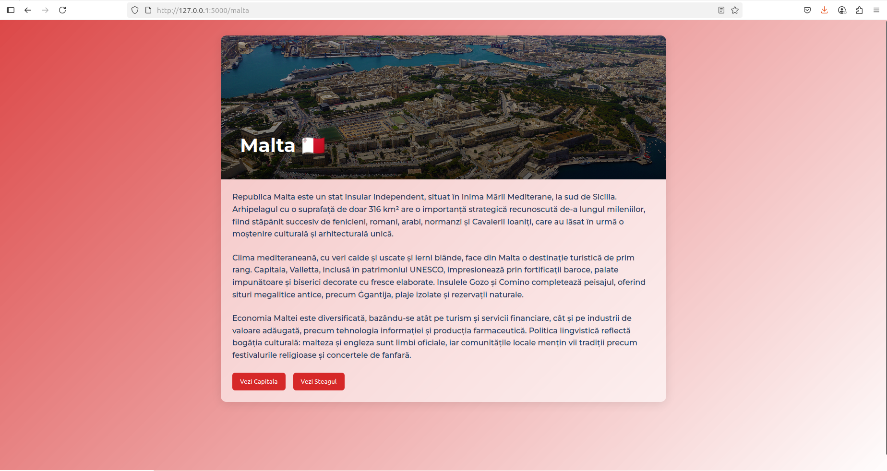

# Proiect SCC – Țări: Spania
### Spania – Balan Carla

## Cuprins
- [Descriere generală](#descriere-generală)
- [Funcționalitate implementată](#funcționalitate-implementată)
- [Stadiu dezvoltare](#stadiu-dezvoltare)
- [Testare manuală în browser](#testare-manuală-în-browser)
- [Testare automată cu pytest](#testare-automată-cu-pytest)
- [Validare cod cu pylint](#validare-cod-cu-pylint)
- [Testare cu Docker](#testare-cu-docker)
- [Testare cu Jenkins](#testare-cu-jenkins)
- [Resurse](#resurse)

## Descriere generală
Tema comună a grupei 444D este „Țări”, iar eu am ales să implementez funcționalități legate de **Spania**. Aplicația este construită folosind framework-ul Flask și a fost testată, containerizată și integrată într-un mediu de tip DevOps cu ajutorul Jenkins și Docker.

## Funcționalitate implementată
În acest branch am adăugat:

- Fișierul `app/lib/biblioteca_spania.py` cu trei funcții:
  - `capitala_spania()` – returnează capitala Spaniei.
  - `steag_spania()` – returnează o imagine reprezentativă cu steagul Spaniei.
  - `descriere_spania()` – oferă o descriere generală a țării.

- Patru rute noi în fișierul `app/444D_tari.py`:
  - `/spania` – pagină principală pentru Spania.
  - `/spania/capitala` – afișează capitala.
  - `/spania/steag` – afișează steagul.
  - `/spania/descriere` – oferă o scurtă descriere.

- Fișierul `app/tests/test_biblioteca_spania.py` care conține testele automate pentru funcțiile definite.

## Stadiu dezvoltare
- Funcționalitate complet implementată
- Cod adăugat în branch-ul `devel_balan_carla`
- Dockerfile și Jenkinsfile create și funcționale
- Testare locală, automată și containerizată realizată cu succes
- Pull Request în curs de integrare către `main`

## Testare manuală în browser
După clonarea repository-ului într-un director numit proiect_scc:

```bash
git clone https://github.com/Iacob45/curs_vcgj_4_tari.git
cd curs_vcgj_4_tari
git checkout devel_balan_carla
```

Se activează mediul virtual și se pornește aplicația cu:

```bash
source activeaza_venv
source ruleaza_aplicatia
```

Aplicația poate fi accesată în browser la adresa:

```
http://127.0.0.1:5011/spania
```

De asemenea, se pot verifica următoarele rute:
- `/spania/capitala`
- `/spania/steag`
- `/spania/descriere`




## Testare automată cu `pytest`
Testele au fost scrise în fișierul `app/tests/test_biblioteca_spania.py`. Cu mediul virtual activ, rularea testelor se face astfel:

```bash
pytest app/tests/test_biblioteca_spania.py
```

Toate testele au fost executate cu succes, validând corectitudinea funcțiilor definite.


## Validare cod cu `pylint`
Pentru respectarea standardelor de stil și bune practici în Python, fișierul `biblioteca_spania.py` a fost verificat cu `pylint`:

```bash
pylint app/lib/biblioteca_spania.py
```

Scorul obținut este satisfăcător, fără erori majore de structură sau sintaxă.


## Testare cu Docker
Pentru asigurarea portabilității aplicației, a fost creat un container Docker. Pașii efectuați:

1. Construirea imaginii:
```bash
sudo docker build -t tari:v04 .
```


2. Rularea containerului:
```bash
sudo docker run --name tari -p 8020:5011 tari:v04
```


3. Accesarea aplicației în browser:
```
http://localhost:8020/spania
```


## Testare cu Jenkins
Pentru integrarea continuă a proiectului, am folosit Jenkins ca instrument de automatizare a etapelor de testare și construire. Am verificat starea sistemului jenkins cu comanda: 
```bash
sudo systemctl status jenkins
```
Dacă sistemul este inactiv, îl vom porni:
```bash
sudo systemctl start jenkins
```
Se creează pipeline-ul pe Jenkins, care este accesat local, pe portul 8080 și se conectează cu repository-ul. 

Odată creat, se verifică funcționalitatea cu Build: 


## Resurse
- Repository GitHub: [https://github.com/Iacob45/curs_vcgj_4_tari](https://github.com/Iacob45/curs_vcgj_4_tari)
- Branch de lucru: `devel_balan_carla`
