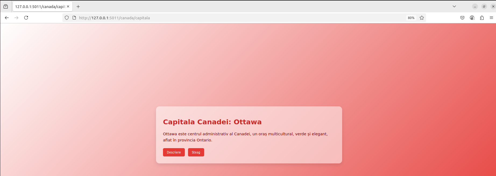
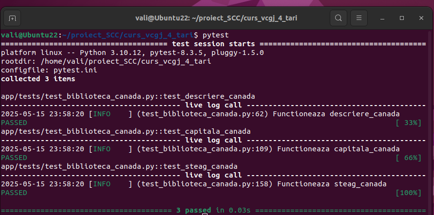
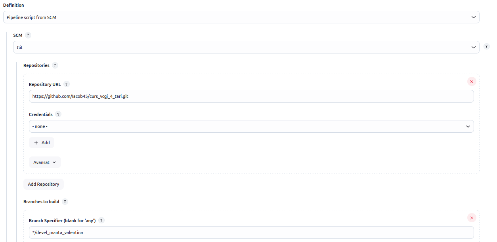
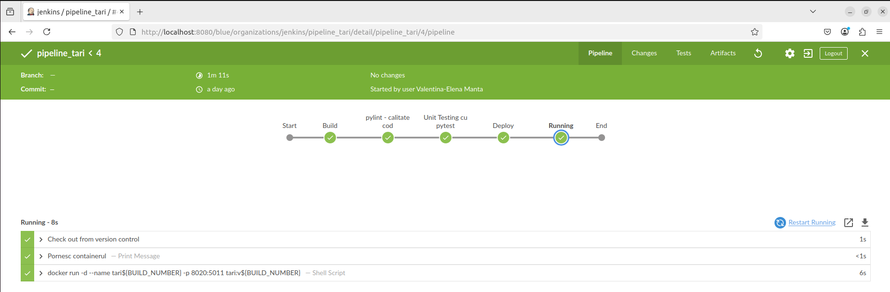

# Proiect curs_vcgj_4_tari
Proiect DevOps, virtualizare, containerizare, github, jenkins. 
Acest proiect contine o aplicatie Flask simpla, cu 3 endpoint-uri: "/" -> descrierea; "/capitala" -> capitala ; "/steag" -> steagul.
Se foloseste un fisier principal "tari.py" care contine cele 3 endpoint-uri, se folosesc biblioteci de functii care
intorc cod HTML in acele endpoint-uri, se folosesc biblioteci de functii de testare, se foloseste Docker pentru containerizare
si Jenkins pentru tot procesul de automatizare.

Tema proiect: Tari.

Teme luate: 
    Grecia: Roberta, 
    Spania: Carla,
    Canada: Vali,
    Kosovo: Alexandra,
    Franta: Stefi,
    Brazilia: Andreea,
    Lituania: Calcan,
    Egipt: Monica,
    Italia: Daria,
    Japonia: Ilie,
    Danemarca: Razvan,
    Malta: Ana,
    Germania: Gutescu,
    Olanda: Daniela,
    Romania: Iacob,
    Cristiana: Bulgaria,
    Sasha: Guatemala,
    Luxemburg: Buta,
    Vatican: Miron,
    Honduras: Furniga,
    Andorra: Maya,
    Monaco: Catalin,
    Norvegia: Dumitru
    
## Cuprins

- I. ROMANIA - Delcea Andrei-Iacob
- II. HONDURAS - Furniga Silviu Andrei
- III. CANADA - Manta Valentina
- IV - LUXEMBOURG- Buță Cosmin Andrei
- V - GRECIA- Filip Stefania Roberta
- VI - MALTA - Nanu Ana-Maria

## I. ROMANIA - Delcea Andrei-Iacob
„Info Romania” — Serviciu Web cu Flask 🇷🇴

Un serviciu web simplu, realizat în Python cu Flask, care afișează informații despre România: descriere generală, capitală și drapel.


## INDEX

* INTRODUCERE
* STRUCTURĂ
* PREGĂTIRE MEDIU
* RULARE LOCALĂ
* DOCKER
* RUTE DISPONIBILE
* TESTARE
* LINT ȘI CALITATE
* CI/CD (Jenkins)
* SCRIPTURI
* DEPENDINȚE
* LICENȚĂ & CONTRIBUȚII


## INTRODUCERE

Serviciul expune trei pagini HTML generate din funcții Python:

* **Descriere** – prezentare succintă a țării
* **Capitală** – afișează „București”
* **Tricolor** – afișează imaginea drapelului României


## STRUCTURĂ

```text
ProjectRoot/
│
├── tari.py                 # Flask app cu rutele HTTP
├── quickrequirements.txt   # Lista pachetelor Python
├── pytest.ini              # Configurații pytest
├── Jenkinsfile             # Pipeline: build, lint, test, deploy, run
├── Dockerfile              # Instrucțiuni Docker
├── dockerstart.sh          # Entrypoint pentru container
├── activeaza_venv          # Script venv local
├── activeaza_venv_jenkins  # Script venv Jenkins
├── ruleaza_aplicatia       # Script pornire server local
├── static/                 # Resurse statice
│   └── romania_flag.jpg    # Imagine drapel
└── app/                    # Codul organizațional
    ├── lib/                # Biblioteci interne
    │   ├── biblioteca_romania.py   # Generare text Romania
    │   └── biblioteca_header.py    # Generare header HTML
    └── tests/              # Teste unitare
        ├── test_biblioteca_romania.py
        └── test_biblioteca_header.py
```


## PREGĂTIRE MEDIU

1. Clonare repo:

```bash
git clone [https://github.com/Iacob45/curs\_vcgj\_4\_tari.git](https://github.com/Iacob45/curs_vcgj_4_tari.git)
cd curs\_vcgj\_4\_tari
```

2. Creare & activare virtualenv:
   ```bash
python3 -m venv .venv
source .venv/bin/activate   # Windows: .venv\Scripts\activate
```

3. Instalare dependențe:

```bash
pip install -r quickrequirements.txt
```


## RULARE LOCALĂ
Pornire server Flask pe portul **5011**:
```bash
bash ruleaza_aplicatia
````

Acces: `http://localhost:5011/romania`


## DOCKER

* Construire imagine:
```bash
docker build -t info-romania .
```

* Rulare container:
```bash
docker run -d -p 5011:5011 info-romania
```


## RUTE DISPONIBILE

* **GET** `/romania`        → descriere generală
* **GET** `/romania/capitala` → capitala (București)
* **GET** `/romania/steag`     → afișare drapel

Fiecare pagină include butoane de navigare create de `biblioteca_header`.


## TESTARE

* Testează biblioteca principală:

```bash
export PYTHONPATH=.
pytest app/tests/test\_biblioteca\_romania.py
```

* Testează header:
```bash
export PYTHONPATH=.
pytest app/tests/test_biblioteca_header.py
```

* Pentru ambele simultan:

```bash
pytest
```


## LINT ȘI CALITATE
Verifică stilul codului cu pylint:
```bash
pylint --exit-zero $(find app/lib -name '*.py')
pylint --exit-zero $(find app/tests -name '*.py')
pylint --exit-zero tari.py
````


## CI/CD (Jenkins)

**Jenkinsfile** realizează:

* *BUILD* – setare venv
* *LINT* – pylint pe librării și teste
* *TEST* – `flask --app tari test`
* *DEPLOY* – build Docker image
* *RUN* – rulează containerul


## SCRIPTURI

* **activeaza\_venv**, **activeaza\_venv\_jenkins** – creare + activare venv
* **ruleaza\_aplicatia** – pornire Flask local
* **dockerstart.sh** – activare venv + pornire Flask în Docker


## DEPENDINȚE

* Flask
* pytest
* pylint
* matplotlib
* gunicorn


## LICENȚĂ & CONTRIBUȚII

Licența este definită în fișierul `LICENSE`. Contribuțiile sunt binevenite prin pull request-uri care trec testele și lint-ul.


## II. HONDURAS - Furniga Silviu Andrei
**Aplicație Flask: Informații despre Honduras**

Această aplicație oferă informații despre Honduras printr-o interfață web simplă bazată pe Flask. Include trei endpoint‑uri care returnează conținut HTML: descriere generală a țării, capitala și imaginea steagului.

---

## Cuprins

- I. Structura proiectului
- II. Instalare și configurare
- III. Rulare aplicație
- IV. Endpoint-uri disponibile
- V. Testare
- VI. Controlul calității codului
- VII. CI/CD (Jenkins)
- VIII. Docker
- IX. Scripturi utile
- X. Dependințe externe
- XI. Licență

---

# I. Structura proiectului

```
├── tari.py                      # Fișierul principal al aplicației Flask
├── ruleaza_aplicatia            # Script Bash pentru rularea aplicației
├── quickrequirements.txt        # Lista modulelor externe necesare
├── pytest.ini                   # Configurația pytest
├── Jenkinsfile                  # Pipeline CI/CD (Build, Quality, Test, Deploy, Run)
├── Dockerfile                   # Definiție imagine Docker
├── dockerstart.sh               # Entrypoint pentru container Docker
├── activeaza_venv               # Script de activare venv local
├── activeaza_venv_jenkins       # Script de creare și activare venv în Jenkins
├── LICENSE                      # Licența proiectului
├── README.md                    # Documentația proiectului
├── .gitignore                   # Fișier de excludere Git
├── static/                      # Fișiere statice (imagini, CSS, etc.)
│   └── honduras__42861.jpg      # Steagul Honduras
└── app/                         # Codul aplicației organizat în pachete
    ├── lib/                     # Funcții de generare a conținutului HTML
    │   └── biblioteca_honduras.py
    └── tests/                   # Teste unitare pentru bibliotecă
        └── test_biblioteca_honduras.py
```

---

# II. Instalare și configurare

### 1. Clonare repository

```bash
git clone https://github.com/Iacob45/curs_vcgj_4_tari.git
cd curs_vcgj_4_tari
```

### 2. Configurare mediu Python

```bash
python3 -m venv .venv
source .venv/bin/activate     # Windows: .venv\Scripts\activate
pip install --upgrade pip
pip install -r quickrequirements.txt
```

### 3. Fișier de configurare pentru testing

* `pytest.ini` definește directorul rădăcină și markerii folosiți.

---

# III. Rulare aplicație

### Local

```bash
bash ruleaza_aplicatia
```

### Docker

```bash
docker build -t aplicatie-honduras .
docker run --rm -p 5011:5011 aplicatie-honduras
```

Aplicația va fi disponibilă pe `http://localhost:5011/honduras`

---

# IV. Endpoint-uri disponibile

| Ruta                 | Descriere                                 | Metodă |
| -------------------- | ----------------------------------------- | ------ |
| `/honduras`          | Descriere generală a Honduras             | GET    |
| `/honduras/capitala` | Informații despre capitala Honduras       | GET    |
| `/honduras/steag`    | Afișează steagul Honduras ca imagine HTML | GET    |

Fiecare pagină include linkuri de navigare între endpoint-uri și conținut HTML generat din `app/lib/biblioteca_honduras.py`.

---

# V. Testare

Testele sunt în `app/tests/test_biblioteca_honduras.py` și verifică funcțiile:

- descriere_honduras()
- capitala_honduras()
- steag_honduras()

Rulare teste:

```bash
# PYTHONPATH=. este setat pentru ca toate directoarele si fiserele
# din proiect sa fie vizibile
export PYTHONPATH=.
pytest -v
```

---

# VI. Controlul calității codului

Se folosește `pylint` pentru analiza statică a codului. Pentru a rula:

```bash
pylint app/lib/biblioteca_honduras.py app/tests/test_biblioteca_honduras.py tari.py
```

---

# VII. CI/CD (Jenkins)

Pipeline-ul definit în `Jenkinsfile` conține următoarele etape:

1. **Build** – verifică structura directorului, pornește mediul virtual
2. **Controlul calității** – rulează `pylint` pe toate fișierele relevante
3. **Unit Testing** – rulează `pytest`
4. **Deploy** – creează o imagine Docker marcată cu `BUILD_NUMBER`
5. **Run** – pornește containerul cu portul 8020 mapat la 5011

---

# VIII. Docker

- **Dockerfile**: imagine bazată pe Python 3.10 Alpine, creează utilizator non-root, copiază codul și scripturile, setează permisiuni și rulează aplicația cu entrypointul `dockerstart.sh`.
- **dockerstart.sh**: activează mediul virtual și pornește aplicația cu `flask run` pe `0.0.0.0:5011`

---

# IX. Scripturi utile

dockerstart.sh – entrypoint pentru aplicație în Docker
ruleaza_aplicatia – pornește serverul Flask local
activeaza_venv / activeaza_venv_jenkins – creează și activează mediu virtual pentru local și Jenkins

---

# X. Dependințe externe

- Flask
- pytest
- pylint
- matplotlib
- gunicorn

---

# XI. Licență

Acest proiect este licențiat sub licența MIT definită în fișierul `LICENSE`.


## III. CANADA - Manta Valentina-Elena

Stadiul implementării: funcționalitate completă, testare finalizată, integrare realizată în branch-ul principal `main_manta_valentina`.

## Cuprins

- [Element adăugat](#element-adăugat)
- [Flux de lucru Git și Pull Request-uri](#Flux-de-lucru-Git-și-Pull-Request-uri)
- [Integrare și colaborare GitHub](#Integrare-și-colaborare-GitHub)
  - [Pull Request-uri proprii](#Pull-Request-uri-proprii)
  - [Review-uri efectuate](#Review-uri-efectuate)
- [Implementare funcționalitate](#implementare-funcționalitate)
- [Rulare locală a aplicației](#rulare-locală-a-aplicației)
- [Rulare aplicație cu Docker](#rulare-aplicație-cu-docker)
- [Testare cu pytest](#testare-cu-pytest)
- [Testare calitate cod cu pylint](#testare-calitate-cod-cu-pylint)
- [Testare automată cu Jenkins](#testare-automată-cu-jenkins)
  - [Etapele testării](#etapele-testării)

## Element adăugat

Am integrat funcționalitatea corespunzătoare țării **Canada** în aplicația software dezvoltată la nivelul grupei.

## Implementare funcționalitate

Am implementat funcțiile specifice elementului adăugat în `app/lib/biblioteca_canada.py` care vor afișa informațiile necesare descrierii generale a țării:

- `descriere_canada()`
- `capitala_canada()`
- `steag_canada()`

Aplicația principală, `tari.py`, definește 3 rute implementate cu ajutorul framework-ului Flask, accesibile prin metoda HTTP `GET`, fiecare returnând conținut HTML generat de funcțiile de mai sus. Fiecare rută corespunde unei componente informaționale distincte.

- `GET /canada` – punct de intrare general care oferă o descriere pe scurt a Canadei;
- `GET /canada/capitala` – returnează numele capitalei Canadei;
- `GET /canada/steag` – returnează drapelul Canadei.

Modulul a fost integrat în aplicația existentă astfel încât să respecte arhitectura propusă și să poată fi extins ușor cu funcționalități suplimentare.

## Flux de lucru Git și Pull Request-uri

Pentru dezvoltarea funcționalității, am utilizat un flux de lucru organizat pe ramuri (branch-uri), care respectă bunele practici de colaborare GitHub.

Inițial, am implementat codul în branch-ul personal de dezvoltare: `devel_manta_valentina`. După ce funcționalitatea a fost testată local, analizată cu `pylint` și validată prin teste cu `pytest` și Jenkins, codul a fost integrat progresiv:

 **PR intern** – am realizat un *Pull Request* de la `devel_manta_valentina` către `main_manta_valentina` pentru a valida integritatea codului meu și a simula procesul de integrare.

Fiecare Pull Request a fost supus unui proces de revizuire (`code review`) din partea colegilor de grupă. Acest flux a asigurat o integrare controlată și o dezvoltare colaborativă coerentă.

## Integrare și colaborare GitHub

În cadrul procesului de colaborare și validare a codului, am respectat cerințele impuse pentru integrarea prin Pull Request-uri (PR):

- La deschiderea Pull Request-ului către `main_manta_valentina`, am inclus rezultatele rulării testelor automate în Jenkins (capturi + status PASS).
- După validarea codului, PR-ul a fost aprobat și integrat.

### Pull Request-uri proprii

- PR #9 - Devel manta valentina
- PR #22 - Actualizare aplicatie 2

### Review-uri efectuate

- PR #23 - Test PR 1
- PR #26 - Devel barbu andreea

## Rulare locală a aplicației

Pentru a putea testa funcționalitatea adăugată, aplicația poate fi rulată local, într-un mediu virtual Python `(.venv)`.

1. Se clonează repository-ul și se accesează branch-ul de dezvoltare corespunzător:

```bash
mkdir proiect_SCC
cd proiect_SCC
git clone https://github.com/Iacob45/curs_vcgj_4_tari.git
cd curs_vcgj_4_tari
git checkout devel_manta_valentina
```

2. Se activează venv în directorul curent și se rulează aplicația, urmând a fi accesată în browser la adresa 127.0.0.1:5011/canada:

```bash
source activeaza_venv
source ruleaza_aplicatia
```





## Rulare aplicație cu Docker

Pentru a asigura portabilitatea și rularea aplicației într-un mediu izolat, proiectul a fost containerizat folosind Docker. Prin fișierul `Dockerfile` se configurează Flask, se creează mediul de rulare al aplicației și dependințele acesteia. Pornirea aplicației este asigurată de scriptul `dockerstart.sh`.

1. Acest proces presupune crearea unei imagini Docker care include codul aplicației, dependențele Python și configurațiile necesare pentru execuție.

```bash
sudo docker build -t tari:v04 .
```

2. După construirea imaginii, aplicația poate fi rulată într-un container, accesibil local prin browser (portul 5011 este mapat pe 8020). Astfel, indiferent de sistemul de operare sau de configurația locală, funcționalitatea poate fi testată și demonstrată uniform.

```bash
sudo docker run --name tari -p 8020:5011 tari:v04
```


## Testare cu pytest

Folosind framework-ul Python **pytest** am dezvoltat teste unitare, construite pentru a verifica dacă funcțiile `descriere_canada()`, `capitala_canada()` și `steag_canada()` returnează conținutul HTML corespunzător, conform specificațiilor. În cazul trecerii unui test, valoarea returnată va fi PASS, iar în caz contrar FAIL. Fișierul `pytest.ini` controlează testele, direcționând în principal către locația fișierului ce conține testele efective, `app/tests/test_biblioteca_canada.py`.

1. Inițial, se pornește testarea aplicației prin comanda: `pytest`.

2. După efectuarea tuturor testelor create, în consolă se pot observa rezultatele fiecărui test și eventualele comentarii.



## Testare calitate cod cu pylint

Instrumentul de analiză statică a codului Python, pylint, a fost utilizat pentu a evalua calitatea codului aplicației principale (complexitate, repetiții), stilul codului, variabile, funcții neutilizate.

1. Pornirea testării se face prin comanda `pylint tari.py`.

2. Rezultatele sunt observate în consolă la final și sunt returnate note, scoruri, recomandări și coduri ale eventualelor erori.


## Testare automată cu Jenkins

Jenkins este un utilitar open-source de integrare continuă (CI) pe care l-am folosit cu scopul automatizării testării aplicației. Acest lucru este important, deoarece permite integrarea pe branch-urile principale doar a aplicaților funcționale.

1. Pentru început, se verifică starea serviciului Jenkins și se pornește. Platforma web a utilitarului se accesează local, https://localhost:8080.

```bash
systemctl status jenkins
jenkins
```

2. În aplicația web, se creează pipeline-ul, cu setările aferente preluării datelor din repository-ul proiectului.



3. Pentru a începe testarea se apasă **Build**, iar rezultatele se pot observa cu ajutorul plug in-ului **Blue Ocean**, foarte detaliat pe fiecare etapă în parte.



### Etapele testării

Fișierul `Jenkinsfile` conține cele 5 etape de testare automată prin care va trece programul pentru a analiza complet aplicația.

1. **Build** ~
Are rolul de a crea mediul de lucru necesar aplicației, prin activarea mediului virtualizat (.venv).

2. **pylint-calitate cod** ~
Testează calitatea codului prin rularea pylint pe fișierele din `app/lib/`, `app/tests/`, `tari.py`. Flow-ul de testare nu va fi oprit în cazul erorilor.

3. **Unit Testing cu pytest** ~
Rulează aplicația prin comanda `flask --app tari test`, care declanșează pytest. Astfel, se verifică dacă HTML-ul returnat este corect.

4. **Deploy** ~
Creează o imagine Docker cu etichetă tari:v<ID> și build ID-ul este unic la fiecare rulare (variabila ${BUILD_NUMBER}).

5. **Running** ~
Pornește container-ul în fundal, rulează aplicația în container Docker și asociază portul 8020 de pe host cu portul 5011 de pe container.

IV - Buță Cosmin Andrei
 ##Luxembourg - Buță Cosmin Andrei

##Cuprins
-Descriere
-Obiectiv
-Utiliare
-Setup
-Implementare
-containerizare
-jenkins

Descriere

Proiect dedicat temei "Țări" în cadrul cursului SCC, implementând technologii precum Flask, Docker, Jenkins și Git/GitHub.

 Obiectiv

Dezvoltarea unei microaplicații web pentru Luxembourg utilizând Flask, cu 3 endpoint-uri distincte ("/luxembourg", "/luxembourg/capitala", "/luxembourg/steag") pentru afișarea informațiilor relevante. Implementarea CI/CD via Jenkins și containerizare prin Docker.

 Utilitare folosite

- **Flask**: Framework web lightweight pentru Python
- **Docker**: Platformă de containerizare pentru deployment izolat
- **Jenkins**: Server de automatizare pentru CI/CD
- **Git/GitHub**: Sistem VCS pentru managementul codului sursă

 Setup local

Configurare Git:
```bash
git config --global user.name "username"
git config --global user.email "email"
```

Clonare repository:
```bash
git clone https://github.com/<user>/curs_vcgj_4_tari.git
cd curs_vcgj_4_tari
```

Setup environment:
```bash
python3 -m venv .venv
source .venv/bin/activate
```

Structură proiect:


Instalare dependencies:
```bash
pip install -r requirements.txt
```

Lansare server:
```bash
export FLASK_APP=tari
flask run -p 5011 --reload
```

## Implementare `tari.py`

`tari.py` configurează aplicația Flask și definește rutele API pentru informațiile despre Luxembourg.

### Import dependencies
- Flask: Core framework 
- Modulele interne: `biblioteca_header` și `biblioteca_luxembourg`

### Server initialization
- Instanțiere Flask app

### Routing implementation

1. **Endpoint principal ("/luxembourg")**
   - Handler pentru requesturi HTTP GET
   - Renderizare template cu descrierea Luxembourg
   - Implementare: `header_descriere()` + `descriere_luxembourg()`

2. **Endpoint capitală ("/luxembourg/capitala")**
   - Handler GET pentru informații despre Luxembourg City
   - Implementare: `header_capitala()` + `capitala_luxembourg()`

3. **Endpoint steag ("/luxembourg/steag")**
   - Handler GET pentru drapelul național
   - Implementare: `header_steag()` + `steag_luxembourg()`

## Containerizare Docker

Build image:
```bash
docker build -t <nume> .
```

Deploy container:
```bash
docker run -dp 5011:5011 <nume>
```

Acces API:
- http://localhost:5011

## Dockerfile specs

Implementare multi-stage build pentru optimizare:

1. **Base image**: `python:3.10-alpine` (lightweight)
2. **ENV config**: Setare variabile FLASK_APP
3. **Security enhancements**: Utilizator non-privilegiat
4. **Workspace setup**: Working directory și copy application files
5. **Dependency management**: Instalare packages via pip
6. **Permission handling**: Configurare ownership și permissions
7. **Network config**: Expunere port 5011
8. **Entrypoint setup**: Script startup pentru lansare server

## Testing framework

### Unit testing via pytest
```bash
pytest app/tests/
```

### pytest.ini configuration

Setări avansate pentru test runner:

1. `pythonpath = .`: Setare import path relativă la root
2. `testpaths = app/tests`: Locație test suite
3. `log_cli = true`: Activare CLI logging
4. `log_cli_level = DEBUG`: Verbose debugging
5. `log_cli_format`: Pattern formatare logs avansate
6. `log_cli_date_format`: Format timestamp ISO 8601

### CI/CD via Jenkins
Automatizare build & deployment pipeline.

Server initialization:
```bash
jenkins
```

Pipeline configuration:


## Jenkinsfile architecture

Pipeline declarativ pentru CI/CD:

1. **Build stage**: Compilare Docker image și tagging cu build number
2. **Code quality**: Static analysis via pylint pentru code quality metrics
3. **Unit testing**: Execuție test suite via pytest framework
4. **Deployment**: Build production-ready Docker image
5. **Runtime**: Lansare container cu port mapping și health checks
6. **Cleanup**: Teardown și resource cleanup post-execution

V. GRECIA - Filip Stefania Roberta

##Grecia-Filip Stefania Roberta

##Cuprins
-Descriere
-Obiectiv
-Utiliare
-Setup
-Implementare
Descriere

Proiect dedicat temei "Țări" în cadrul cursului SCC, implementând technologii precum Flask, Docker, Jenkins și Git/GitHub.

 Obiectiv

Dezvoltarea unei microaplicații web pentru Grecia utilizând Flask, cu 3 endpoint-uri distincte ("/grecia", "/grecia/capitala", "/grecia/steag") pentru afișarea informațiilor relevante. Implementarea CI/CD via Jenkins și containerizare prin Docker.

 Utilitare folosite

- *Flask*: Framework web lightweight pentru Python
- *Docker*: Platformă de containerizare pentru deployment izolat
- *Jenkins*: Server de automatizare pentru CI/CD
- *Git/GitHub*: Sistem VCS pentru managementul codului sursă

 Setup local

Configurare Git:
bash
git config --global user.name "username"
git config --global user.email "email"


Clonare repository:
bash
git clone https://github.com/<user>/curs_vcgj_4_tari.git
cd curs_vcgj_4_tari


Setup environment:
bash
python3 -m venv .venv
source .venv/bin/activate


Instalare dependencies:
bash
pip install -r requirements.txt


Lansare server:
bash
export FLASK_APP=tari
flask run -p 5011 --reload


## Implementare tari.py

tari.py configurează aplicația Flask și definește rutele API pentru informațiile despre Grecia.

### Import dependencies
- Flask: Core framework 
- Modulele interne: biblioteca_header și biblioteca_grecia

### Server initialization
- Instanțiere Flask app

### Routing implementation

1. *Endpoint principal ("/Grecia")*
   - Handler pentru requesturi HTTP GET
   - Renderizare template cu descrierea Grecia
   - Implementare: header_descriere() + descriere_grecia()

2. *Endpoint capitală ("/Grecia/capitala")*
   - Implementare: header_capitala() + capitala_grecia()

3. *Endpoint steag ("/Grecia/steag")*
   - Handler GET pentru drapelul național
   - Implementare: header_steag() + steag_grecia()

## Containerizare Docker

Build image:
bash
docker build -t <nume> .


Deploy container:
bash
docker run -dp 5011:5011 <nume>


Acces API:
- http://localhost:5011

## Dockerfile specs

Implementare multi-stage build pentru optimizare:

1. *Base image*: python:3.10-alpine (lightweight)
2. *ENV config*: Setare variabile FLASK_APP
3. *Security enhancements*: Utilizator non-privilegiat
4. *Workspace setup*: Working directory și copy application files
5. *Dependency management*: Instalare packages via pip
6. *Permission handling*: Configurare ownership și permissions
7. *Network config*: Expunere port 5011
8. *Entrypoint setup*: Script startup pentru lansare server

## Testing framework

### Unit testing via pytest
bash
pytest app/tests/


### pytest.ini configuration

Setări avansate pentru test runner:

1. pythonpath = .: Setare import path relativă la root
2. testpaths = app/tests: Locație test suite
3. log_cli = true: Activare CLI logging
4. log_cli_level = DEBUG: Verbose debugging
5. log_cli_format: Pattern formatare logs avansate
6. log_cli_date_format: Format timestamp ISO 8601

### CI/CD via Jenkins
Automatizare build & deployment pipeline.

Server initialization:
bash
jenkins


## Jenkinsfile architecture

Pipeline declarativ pentru CI/CD:

1. *Build stage*: Compilare Docker image și tagging cu build number
2. *Code quality*: Static analysis via pylint pentru code quality metrics
3. *Unit testing*: Execuție test suite via pytest framework
4. *Deployment*: Build production-ready Docker image
5. *Runtime*: Lansare container cu port mapping și health checks
6. *Cleanup*: Teardown și resource cleanup post-execution

## VI. MALTA - Nanu Ana-Maria

##  CUPRINS

- [Descriere](#descriere) 
- [Obiectiv](#obiectiv) 
- [Stadiu curent](#stadiu-curent)
- [Tehnologii folosite](#tehnologii-folosite) 
- [Crearea și activarea mediului virtual](#crearea-și-activarea-mediului-virtual) 
- [Structura și fișierele proiectului](#structura-și-fișierele-proiectului) 
- [Instalarea dependințelor](#instalarea-dependențelor) 
- [Implementare functionalitati](#implementare-functionalitati)
  - [`biblioteca_malta.py`](#descrierea-bibliotecii-malta)
  - [`tari.py`](#descrierea-fisierului-tari.py) 
- [Rularea locala a aplicatiei Flask](#rularea-locala-aplicatiei-flask)
- [Gestionarea codului cu Git & GitHub](#utilizarea-git--github)
  - [Flux de lucru cu Git si Pull Request-uri](#flux-de-lucru-cu-git-si-pull-request-uri)
  - [Integrare si colaborare GitHub](#integrare-si-colaborare-github) 
- [Containerizare cu Docker](#containerizare-cu-docker) 
  - [Descriere Dockerfile](#descriere-dockerfile) 
- [Testare](#testare)
  - [Testare unitara cu pytest](#testare-unitara-cu-pytest) 
  - [Testare automata (Jenkins)](#testare-automata-cu-jenkins) 
  - [Descriere Jenkinsfile](#descriere-jenkinsfile) 

## Descriere

Proiectul prezintă o aplicație web informativă despre Republica Malta, realizată în cadrul cursului Servicii Cloud și Containerizare, folosind tehnologii precum Flask, Docker, Jenkins și Git/GitHub.

## Obiectiv

Acest proiect își propune dezvoltarea unei aplicații web minimaliste, construită cu **Flask**, care oferă utilizatorilor informații esențiale despre Republica Malta — o descriere succintă a țării, detalii despre capitală și prezentarea drapelului — prin intermediul a trei endpoint-uri: `/malta`, `/malta/capitala` și `/malta/steag`. În plus, fluxul de lucru include teste automate orchestrate de **Jenkins**, controlul versiunilor și revizuirea codului prin **Git/GitHub**, precum și containerizarea întregii aplicații cu **Docker**.

## Stadiu curent
**Stadiul implementarii:** funcționalitate completă, testare finalizată, integrare realizată în branch-ul principal `main_nanu_ana`.

## Tehnologii folosite

- Flask: Framework Python pentru dezvoltarea aplicatiei web.
- Docker: Containere pentru rularea aplicatiei intr-un mediu izolat.
- Jenkins: Automatizarea testarii si livrarii aplicatiei.
- Git/GitHub: Colaborare si versionare a codului sursa.


## Crearea si activarea mediului virtual

```bash
 python3 -m venv .venv
 source .venv/bin/activate
```
## Structura și fișierele proiectului


## Instalarea dependintelor
```bash
pip install -r requirements.txt
```


## Implementare functionalitati 

### `biblioteca_malta.py`

Fișierul **`biblioteca_malta.py`** are rolul de a centraliza toată logica de generare a interfeței HTML (conținut + CSS) pentru paginile dedicate Maltei. În esență:

1. **`base_css()`**
   - Definește în interiorul unui bloc `<style>` stilurile comune ale tuturor paginilor:
     - Importă fontul Montserrat de la Google Fonts  
     - Declară variabile CSS (culori primare, gradient de fundal, fundal de card semi‐translucent, accente de hover etc.)  
     - Setează reguli globale de box‐sizing, margin/padding zero, font‐family și line‐height  
     - Stilizează structura de tip card și efectele de hover  
     - Configurează clasa `.hero` pentru banner‐uri parallax cu gradient de suprapunere  
     - Pregătește layout‐ul containerelor, butoanelor și imaginilor inline  

2. **`descriere_malta()`**
   - Apelează `base_css()` pentru a injecta CSS‐ul în pagină  
   - Construiește o pagină HTML cu:
     - Un banner hero care folosește `/static/malta_bg.jpg`  
     - Titlul “Malta 🇲🇹” 
     - Trei paragrafe cu informații despre istoria, clima și economia Maltei  
     - Un set de butoane de navigare către paginile de capitală și steag  

3. **`capitala_malta()`**
   - Reia `base_css()` pentru stilizare  
   - Creează un banner hero cu imaginea Vallettei (`/static/valletta.jpg`)  
   - Afișează un titlu și trei paragrafe despre fondarea și arhitectura capitalei  
   - Inserează o imagine inline (`/static/valletta_strazi.jpg`) care ilustrează străzile iconice  
   - Include butoane “Înapoi la Descriere” și “Vezi Steagul” pentru navigare  

4. **`steag_malta()`**
   - Reaplică `base_css()` pentru consistență vizuală  
   - Generează un banner hero cu `/static/steag_malta_banner.jpg`  
   - Oferă două paragrafe despre semnificația culorilor și a Crucii Sfântului Gheorghe  
   - Inserează imaginea propriu‐zisă a steagului (`/static/steag_malta.png`)  
   - Pune la dispoziție butoanele de navigare “Descriere” și “Vezi Capitala” 

---

**Pe scurt**, acest modul convertește datele și imaginile statice într‐un șablon HTML+CSS coerent și modern, pregătit pentru a fi returnat direct de către rutele Flask (`/malta`, `/malta/capitala`, `/malta/steag`). Separarea clară a funcțiilor de stil (`base_css`) de cele de conținut (`descriere_malta`, `capitala_malta`, `steag_malta`) face codul ușor de întreținut și de extins.

---
### `tari.py`

Fișierul **`tari.py`** definește aplicația Flask și asigură mapping-ul între URL-uri și paginile HTML generate pentru Malta:

```python
from flask import Flask, url_for
from app.lib import biblioteca_malta

api = Flask(__name__)
````

* **`from flask import Flask, url_for`**
  Importă clasa `Flask` necesară pentru inițializarea aplicației și `url_for` pentru generarea dinamică a link-urilor interne.
* **`from app.lib import biblioteca_malta`**
  Încarcă modulul care conține funcțiile de generare HTML (`descriere_malta()`, `capitala_malta()`, `steag_malta()`).

```python
api = Flask(__name__)
```

* Creează o instanță a aplicației Flask numită `api`.
* Argumentul `__name__` permite Flask să găsească corect resursele statice și template-urile.

```python
@api.route("/malta", methods=['GET'])
def index() -> str:
    return biblioteca_malta.descriere_malta()
```

* **Ruta `/malta`**

  * Metoda HTTP: `GET`
  * Handler: funcția `index()` returnează rezultatul `descriere_malta()`, pagina de descriere generală a Maltei.


```python
@api.route("/malta/capitala", methods=['GET'])
def capitala() -> str:
    return biblioteca_malta.capitala_malta()

```

* **Ruta `/malta/capitala`**

  * Metoda HTTP: `GET`
  * Handler: `capitala()` returnează HTML-ul cu informații detaliate despre capitală.


```python
@api.route("/malta/steag", methods=['GET'])
def steag() -> str:
    return biblioteca_malta.steag_malta()
```

* **Ruta `/malta/steag`**

  * Metoda HTTP: `GET`
  * Handler: `steag()` returnează pagina cu drapelul Maltei.


---

**Rolul fișierului**:

* Centralizează configurația aplicației și alocarea celor trei endpoint-uri principale.
* Păstrează separarea responsabilităților:

  * **`tari.py`** se ocupă doar cu definirea rutelor și inițializarea Flask.
  * **`biblioteca_malta.py`** conține logica de generare a conținutului și stilurilor HTML.

Această structură modulară asigură claritate, testabilitate și ușurință în extinderea aplicației (adăugare de noi pagini sau funcționalități).


## Rularea locala a aplicatiei Flask
```bash
flask --app tari run
```

## Gestionarea codului cu Git & GitHub

Setam numele si emailul utilizatorului care va fi asociat cu toate commit-urile facute pe masina

```bash
 git config --global user.name "username"
 git config --global user.email "email"
```
Clonam repo-ul in direcotorul de lucru
```bash
git clone https://github.com/Iacob45/curs_vcgj_4_tari.git
cd curs_vcgj_4_tari
```
Crearea branchurilor individuale

```bash
git branch devel_nanu_ana
git branch main_nanu_ana
```
Mutarea pe branch-ul devel
```bash
git branch devel_nanu_ana
```
Adaugarea fisierelor modificate
```bash
git add .
git commit -m "Mesajul de commit"
```
Aducem modificarile pe GitHub
```bash
git push origin devel_nanu_ana
```
### Flux de lucru Git și Pull Request-uri

Pentru dezvoltarea suportului pentru Malta am urmat un workflow bazat pe branch-uri, după cum urmează:

1. Am creat un branch de feature **`devel_malta_ana`**, unde am implementat toate funcțiile și stilurile necesare (CSS, `descriere_malta()`, `capitala_malta()`, `steag_malta()`).
2. Pe măsură ce finalizam fiecare sub‐task (CSS, conținut, teste), am făcut commit-uri cu mesaje descriptive:  
   - `feat: add base_css and descriere_malta`  
   - `feat: implement capitala_malta page`  
   - `test: add pytest for biblioteca_malta`  
3. După ce tot codul a trecut testele locale (`pytest`, `pylint`) și rularea manuală, am deschis un **Pull Request** din `devel_malta_ana` către `main_malta_ana`:
   - **PR #12** – Adăugare suport Malta: descriere, capitală, steag  
4. În PR am inclus rezultatele rulărilor automate din Jenkins (capturi ecran + status PASS) și instrucțiuni de testare manuală.

Fiecare PR a trecut printr-un proces de code review, pentru a ne asigura că stilul și calitatea codului sunt conforme cu standardele proiectului.

---

### Integrare și colaborare GitHub

Pentru fiecare Pull Request am respectat următoarele bune practici GitHub:

- **Descriere completă** a schimbărilor și modul de testare.  
- **Link-uri** către build-urile relevante din Jenkins.  
- Etichete (labels) „feature”, „CI passed” și „ready for review”.  
- Eliminarea oricăror conflicte de merge înainte de aprobare.


## Containerizare cu Docker

În directorul proiectului (unde se află `Dockerfile`):

```bash
# Build și etichetare imagine
docker build -t tari_malta:v01 .

# Pornire container (mapare port host 8020 → container 5011)
docker run --rm -d --name malta_app -p 8020:5011 tari_malta:v01
```

Accesează aplicația la `http://localhost:8020/malta`

---

### Descriere Dockerfile

* **FROM:** `python:3.10-alpine`
* **ENV FLASK\_APP=tari**
* **USER non-root:** `adduser -D tari` + `USER tari`
* **WORKDIR:** `/home/ana/proiect_scc/curs_vcgj_4_tari/`
* **COPY:** cod, static, scripturi, `requirements.txt`
* **RUN:**

  * `python3 -m venv .venv`
  * `.venv/bin/pip install -r requirements.txt`
  * `chmod +x dockerstart.sh`
* **EXPOSE:** `5011`
* **ENTRYPOINT:** `./dockerstart.sh`
* **CMD:** `flask run --host=0.0.0.0 --port=5011`


## Testare

### Testare unitară cu pytest

Rulează toate testele din `app/tests/` cu:

```bash
pytest -q
```

* Testele sunt configurate în `pytest.ini`:

  * `pythonpath = .` (importă modulele din proiect)
  * `testpaths = app/tests` (rulează doar testele din acest folder)

---

### Testare automată (Jenkins)

* Pipeline-ul este definit în `Jenkinsfile` și pornește la fiecare push sau Pull Request.
* Etapele principale:

  1. **Setup** – creare și activare `.venv`, instalare dependențe
  2. **Lint** – `pylint` pe cod și teste
  3. **Unit Tests** – `pytest`
  4. **Docker Build & Run** – construiește și pornește containerul

Astfel, fiecare schimbare este verificată automat pentru calitate și funcționalitate.


### Descriere Jenkinsfile

Fișierul **`Jenkinsfile`** definește un pipeline declarativ de CI/CD pentru aplicația Malta, cu obiectivul de a asigura consistență, calitate și rulare automată. Iată rolul și motivația fiecărei secțiuni:

- **`agent any`**  
  Permite executarea pe orice nod Jenkins disponibil, pentru flexibilitate și scalabilitate.

- **stage('Build')**  
  - *Scop:* Pregătirea mediului și construire imagine Docker inițială.  
  - *Pași:*  
    1. Se rulează scriptul `activeaza_venv_jenkins` pentru a crea/activa `.venv` și instala dependențe.  
    2. `docker build -t tari:v${BUILD_NUMBER} .` — etichetează imaginea cu numărul build-ului, garantând un identificator unic.

- **stage('pylint - calitate cod')**  
  - *Scop:* Verificarea stilului și a standardelor de cod înainte de testare.  
  - *Motivație:* Detectarea timpurie a problemelor de calitate fără a opri pipeline-ul (`--exit-zero`).  
  - *Pași:*  
    1. Activare venv (`activeaza_venv`) și export `PYTHONPATH=.`, pentru ca pylint să importe modulele corect.  
    2. Rulare `pylint` pe fișierele din `app/lib/`, `app/tests/` și `tari.py`.

- **stage('Unit Testing cu pytest')**  
  - *Scop:* Validarea funcționalității prin teste automate.  
  - *Pași:*  
    1. Activare venv  
    2. `pytest app/tests/` — rulează toate testele unitare din proiect.

- **stage('Deploy')**  
  - *Scop:* Creare imagine Docker finală după validări.  
  - *Motivație:* Separă etapa de build inițial (pentru verificări rapide) de cea de producție.  
  - *Pași:*  
    - `docker build -t tari:v${BUILD_NUMBER} .`

- **stage('Running')**  
  - *Scop:* Rulare container pentru testare manuală sau demonstrație.  
  - *Pași:*  
    - `docker run -d --name tari${BUILD_NUMBER} -p 8020:5011 tari:v${BUILD_NUMBER}`

- **post { always }**  
  - *Scop:* Curățare automată după fiecare build, împiedicând acumularea containerelor inactive.  
  - *Pași:*  
    ```bash
    docker stop tari${BUILD_NUMBER} || true
    docker rm   tari${BUILD_NUMBER} || true
    ```

---

**Rol:**  
1. **Claritate și separare:** Fiecare etapă are responsabilități precise (build, lint, test, deploy, run).  
2. **Reproducibilitate:** Venv-ul și imaginile Docker garantate de scripturi scrise în `activeaza_venv_jenkins` și `Dockerfile`.  
3. **Feedback rapid:** Lint și teste rulate automat ajută la identificarea și rezolvarea rapidă a erorilor.  
4. **Curățenie în mediu:** Secțiunea `post` asigură eliminarea containerelor, menținând nodul Jenkins curat.


