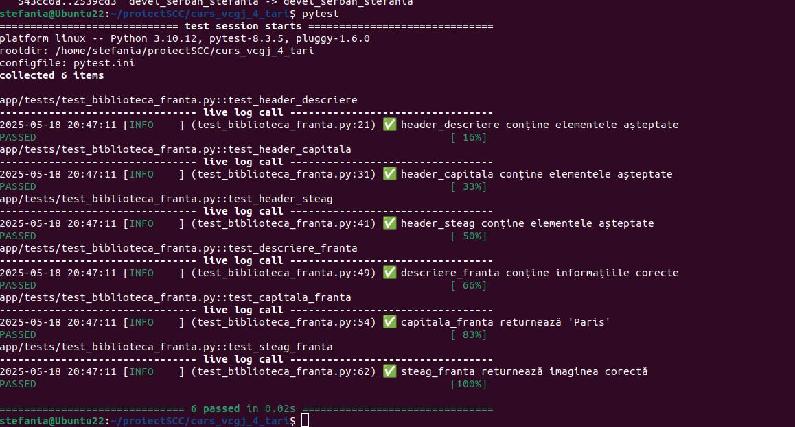

## FRANȚA - ȘERBAN ȘTEFANIA

## Descriere  
În cadrul cursului *Servicii de Cloud și Containerizare*, a fost dezvoltat un proiect cu tema **„Țări”**, care implică utilizarea mai multor tehnologii moderne: Flask, Docker, Jenkins și GitHub.

## Obiectivul proiectului  
Realizarea unei aplicații web pentru **Franța**, care să conțină trei endpoint-uri: 
- `/franta` – Afișează o descriere generală 
- `/franta/capitala` – Afișează informații despre Paris 
- `/franta/steag` – Afișează imaginea drapelului Franței 

Proiectul include, de asemenea: 
- **Testare automată** cu ajutorul Jenkins 
- **Containerizare** folosind Docker pentru a asigura portabilitate și rulare izolată 

---

## Rulare locală a aplicației

Pentru a testa funcționalitatea aplicației în mod local, se recomandă utilizarea unui mediu virtual Python (`.venv`). Mai jos sunt pașii necesari:

### 1. Creare director de lucru și clonare repository

```bash
mkdir proiect_SCC
cd proiect_SCC
git clone https://github.com/Iacob45/curs_vcgj_4_tari.git
cd curs_vcgj_4_tari
git checkout devel_serban_stefania 
```
### 2.  Activarea mediului virtual și rularea aplicației
```bash
source activeaza_venv
source ruleaza_aplicatia
```
După rularea aplicației, aceasta poate fi accesată în browser la următoarele adrese:

- [http://127.0.0.1:5011/franta](http://127.0.0.1:5011/franta) 

- [http://127.0.0.1:5011/franta/capitala](http://127.0.0.1:5011/franta/capitala) 

- [http://127.0.0.1:5011/franta/steag](http://127.0.0.1:5011/franta/steag) 

---

### 3. Containerizarea aplicației cu Docker

Pentru a asigura portabilitatea și rularea aplicației într-un mediu izolat, proiectul a fost containerizat folosind **Docker**. Procesul presupune construirea unei imagini Docker care include codul aplicației, toate dependențele necesare și configurațiile de execuție.

#### Creare imagine Docker

Se creează o imagine Docker locală folosind comanda:

```bash
sudo docker build -t tari:v04 .
```


Aceasta va construi imaginea `tari:v04`, care va conține:
- Codul aplicației Flask
- Scriptul de pornire `dockerstart.sh`
- Mediul virtual Python și toate dependențele din `requirements.txt`

#### Rulare container

După ce imaginea a fost construită, aplicația poate fi rulată într-un container:

```bash
sudo docker run --name tari -p 8020:5011 tari:v04
```

Această comandă pornește aplicația în mod izolat și o expune local la adresa:
```
http://127.0.0.1:8020/franta
```
---

### 4. Testarea aplicației

###  Testare automată cu Pytest

Pentru a valida funcționalitatea aplicației, au fost dezvoltate teste unitare utilizând framework-ul **pytest**. Acestea verifică dacă funcțiile `descriere_franta()`, `capitala_franta()` și `steag_franta()` returnează conținutul HTML corect conform cerințelor.

Testele sunt definite în fișierul `app/tests/test_biblioteca_franta.py`, iar execuția acestora se realizează prin comanda:

```bash
pytest
```
După rulare, în consolă vor fi afișate rezultatele fiecărui test:
- `PASSED` pentru testele validate corect
- `FAILED` pentru testele care nu îndeplinesc așteptările



---

###  Verificare calitate cod cu Pylint

Pentru analiza stilului de programare și a calității codului sursă, a fost utilizat instrumentul **pylint**. Acesta evaluează:

- Respectarea convențiilor PEP8
- Utilizarea eficientă a funcțiilor și variabilelor
- Complexitatea codului

Comanda utilizată:

```bash
pylint tari.py
```
După execuție, pylint generează un raport cu:
- Scorul general al codului (0–10)
- Recomandări pentru îmbunătățiri
- Erori sau avertismente identificate

📷 *Exemplu captură analiză pylint:*


